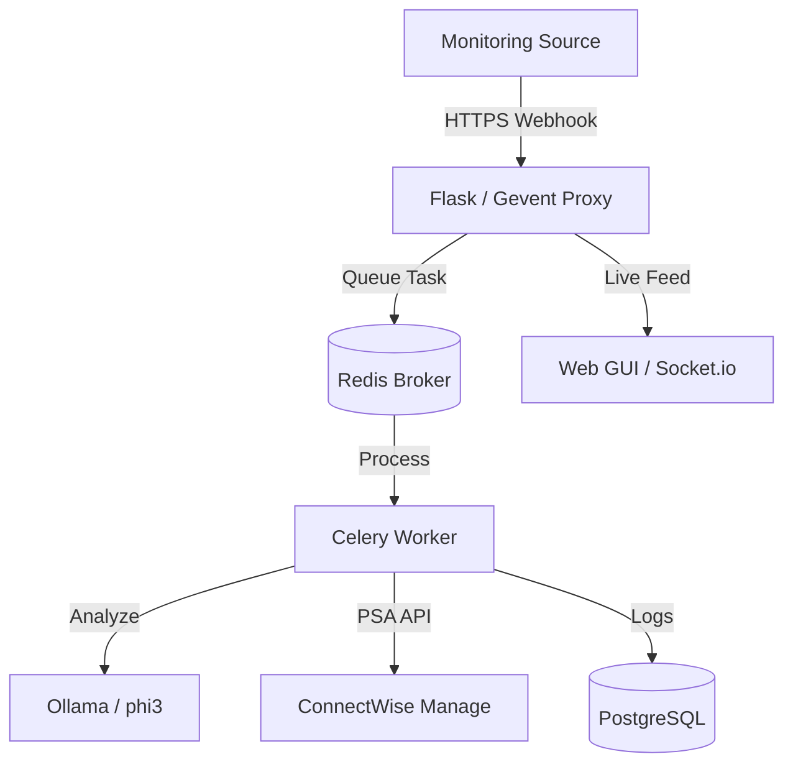
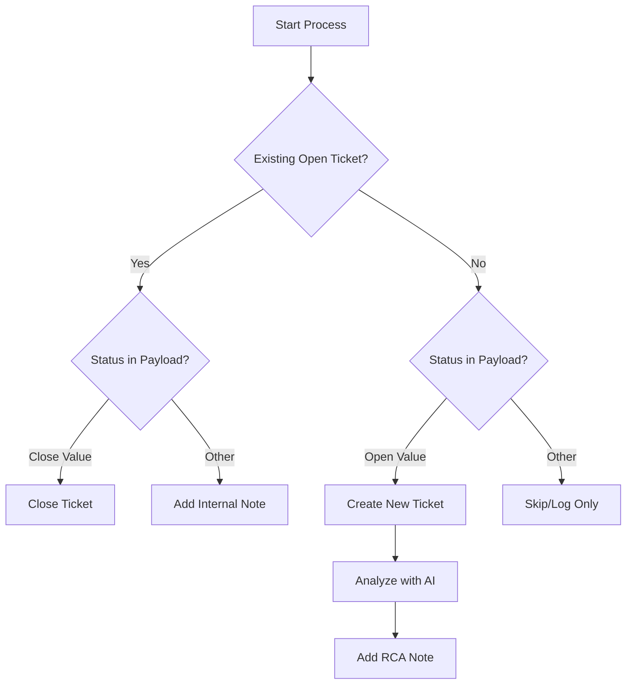
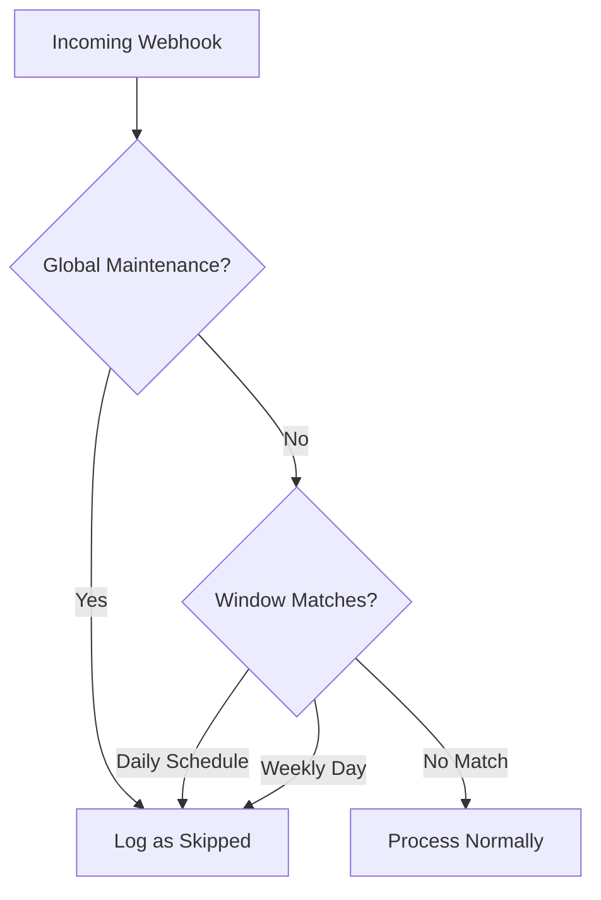
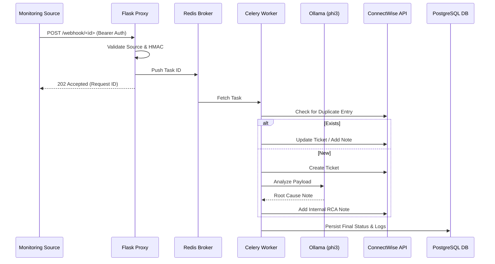

<p align="center">
  
</p>

# HookWise

[](https://github.com/arumes31/hookwise/actions/workflows/ci.yml)
[](https://www.python.org/)
[](https://github.com/astral-sh/ruff)
[](https://opensource.org/licenses/MIT)
[](https://www.docker.com/)

**Enterprise-Grade Webhook Router & ConnectWise Bridge**

HookWise is a highly performant, general-purpose webhook router designed to bridge various monitoring sources (Uptime Kuma, Zabbix, Grafana, Datadog) to **ConnectWise Manage** tickets. Featuring intelligent duplicate detection, asynchronous processing, and local AI-driven analysis.

---

## 📍 Table of Contents
- [Architecture & Flow](#-architecture--flow)
- [Advanced Features](#-advanced-features)
- [API Reference](#-api-reference)
- [AI In-Depth](#-ai-in-depth)
- [Extensive Configuration](#-extensive-configuration)
- [Deep-Dive Usage](#-deep-dive-usage)
- [Configuration Recipes](#-configuration-recipes)
- [Troubleshooting & FAQ](#-troubleshooting--faq)
- [Security & Compliance](#-security--compliance)
- [Development & Contributing](#-development--contributing)

---

## 🏗️ Architecture & Flow

### System Overview
HookWise uses a distributed architecture to ensure reliability and low-latency webhook ingestion.



### Webhook Processing Pipeline
1.  **Ingestion**: Proxy receives payload, validates source IP and HMAC signature.
2.  **Queuing**: Request is assigned a `request_id` and pushed to Redis.
3.  **Processing**: Celery worker pulls the task.
4.  **Resolution**: JSONPath mappings and Regex routing rules are applied.
5.  **Deduplication**: PSA is queried for existing open tickets with the same summary.
6.  **Action**: Ticket is Created, Updated, or Closed in ConnectWise.
7.  **AI Insights**: For new tickets, Ollama generates an automated RCA note.

#### 🔄 Ticket Management Logic


#### 🛡️ Maintenance Suppression Flow


#### ⛓️ The Life of a Webhook (Sequence)


---

## 🚀 Advanced Features

### 🛠️ Intelligent Routing
- **Regex Rule Engine:** Route `CRITICAL` alerts to the "Emergency" board and `WARN` alerts to "Tiling" automatically.
- **Smart Maintenance:** Define recurring maintenance windows (Daily, Weekly, Once) with support for overnight schedules (e.g., 22:00 to 04:00) using UTC-normalized logic.
- **Company Mapping:** Supports `#CW<ID>` in titles or dynamic lookups from payload fields.

### 🧠 AI-Powered Insights
HookWise can generate automated troubleshoot guides using local LLMs. It analyzes the raw payload and adds an **internal note** to the ticket with:
- Potential root causes.
- Suggested troubleshooting steps.
- Technical summary of the alert.

**Managing the Model:**
By default, HookWise uses `phi3`. To pull the latest version or update the model manually:
```bash
docker exec -it hookwise-llm ollama pull phi3
```

### 📋 Observability
- **Live Activity Hub:** Real-time Socket.io feed of all incoming webhooks.
- **Secure Management:** Integrated endpoint deletion with confirmation prompts and CSRF protection.
- **Audit Trail:** Every configuration change is logged with the user and timestamp.
- **Prometheus Metrics:** Native Export for scrapers like Grafana.

---

## 📋 API Reference

All GUI/Admin endpoints require Session Auth or Basic Auth (if configured). Webhook endpoints require Bearer tokens.

### Webhook Ingestion
- `POST /webhook/<endpoint_id>`
  - **Auth**: `Authorization: Bearer <token>`
  - **Returns**: `202 Accepted` with `request_id`.

### Internal API (Admin)
- `GET /api/stats`: Returns daily performance data.
- `POST /history/replay/<log_id>`: Re-processes a historic webhook.
- `GET /api/cw/boards`: Cached proxy to ConnectWise boards.
- `GET /health/services`: Real-time health check for Redis, DB, and Celery.
- `POST /admin/maintenance`: Toggle global maintenance mode.

---

## 🧠 AI In-Depth

HookWise leverages local LLMs via **Ollama** to provide instant RCA (Root Cause Analysis). This means no data ever leaves your network.

### Model Customization
By default, HookWise uses `phi3:latest`. You can swap this for `llama3`, `mistral`, or any other model supported by Ollama:

1. **Pull the model**:
   ```bash
   docker exec -it hookwise-llm ollama pull llama3
   ```
2. **Update Configuration**: Set the `AI_MODEL` environment variable to `llama3`.
3. **Restart Worker**: The Celery worker will now use the new model for all analysis.

### The RCA System Prompt
The analysis is guided by a global system prompt that tells the AI to be concise and focused on remediation. You can customize the **RCA Instructions** per endpoint in the Web GUI, allowing different alerts to receive different styles of analysis (e.g., "Developer-focused" vs "Support-focused").

---

## ⚙️ Extensive Configuration

### PSA Integration
| Variable | Usage |
|----------|-------|
| `CW_TICKET_PREFIX` | Prefix for all summaries (Default: `Alert:`). |
| `CW_SERVICE_BOARD` | Primary board if not overridden. |
| `CW_STATUS_NEW` | Initial status for new tickets. |
| `CW_STATUS_CLOSED` | Status used when an `UP` alert is received. |

### System & Security
| Variable | Usage |
|----------|-------|
| `ENCRYPTION_KEY` | 32-byte Fernet key. **DO NOT LOSE.** |
| `GUI_TRUSTED_IPS`| CIDR list (e.g., `10.0.0.0/24, 192.168.1.5`). |
| `LOG_RETENTION_DAYS`| Auto-cleanup limit for `webhook_log` table. |
| `FORCE_HTTPS` | Redirects all traffic to TLS. |

---

## 📖 Deep-Dive Usage

### JSONPath Mapping Examples
| Destination | Path Example | Result |
|-------------|--------------|--------|
| **Summary** | `$.monitor.name` | Extracts Uptime Kuma monitor name. |
| **Description**| `$.msg` | Extracts the alert body. |
| **Company** | `$.tags.client_id` | Maps dynamic client IDs. |

### Placeholder Templates
Use these in your "Ticket Description Template":
- `{{ monitor_name }}`: The alert source name.
- `{{ msg }}`: The alert message.
- `{{ request_id }}`: Internal tracking ID.
- `{$..field}`: Any valid JSONPath (e.g., `{$..heartbeat.status}`).

### Web GUI Shortcuts
- ` / ` : Focus Search bar.
- `Esc` : Close any open modal.
- `Drag & Drop` : Reorder endpoint priority on the dashboard.

---

## 🚀 Configuration Recipes

### 1. Uptime Kuma (Standard)
Perfect for basic UP/DOWN monitoring.

- **Trigger Field**: `$.heartbeat.status`
- **Open Value**: `0`
- **Close Value**: `1`
- **JSON Mapping**:
  ```json
  {
    "summary": "$.monitor.name",
    "description": "$.heartbeat.msg",
    "customer_id": "$.monitor.tags.CW_ID"
  }
  ```

### 2. Generic Status Webhook
For tools that send text-based statuses like "CRITICAL" or "OK".

- **Trigger Field**: `$.status_text`
- **Open Value**: `CRITICAL, WARNING`
- **Close Value**: `OK, RESOLVED`
- **Ticket Prefix**: `Infrastructure Alert:`

### 3. Advanced Regex Routing
Route alerts to different boards based on the hostname.

- **Routing Rules**:
  ```json
  [
    {
      "path": "$.monitor.hostname",
      "regex": ".*-DB-.*",
      "overrides": {
        "board": "Database Team",
        "priority": "High"
      }
    },
    {
      "path": "$.monitor.hostname",
      "regex": ".*-FE-.*",
      "overrides": {
        "board": "Frontend Team"
      }
    }
  ]
  ```

### 4. Zabbix (Enterprise)
Great for detailed system health and event severity.

- **Trigger Field**: `$.event.status`
- **Open Value**: `PROBLEM`
- **Close Value**: `OK, RESOLVED`
- **JSON Mapping**:
  ```json
  {
    "summary": "$.event.name",
    "severity": "$.event.severity",
    "description": "Trigger: {$.trigger.description}\nHost: {$.host.name}"
  }
  ```

### 5. Grafana Alertmanager
Handle firing and resolved alerts from Grafana dashboards.

- **Trigger Field**: `$.status`
- **Open Value**: `firing`
- **Close Value**: `resolved`
- **JSON Mapping**:
  ```json
  {
    "summary": "$.alerts[0].annotations.summary",
    "description": "$.alerts[0].annotations.description"
  }
  ```

---

## 🏢 Dynamic Company Identification

HookWise provides several ways to automatically map alerts to the correct ConnectWise Client without creating separate endpoints for every customer.

### 1. The "#CW" Magic String (Simplest)
If your monitor name contains `#CW` followed by a ConnectWise Company Identifier, HookWise will automatically route the ticket to that company.
- **Example Monitor Name**: `Firewall Down #CW-AcmeCorp`
- **Result**: Ticket created for company `AcmeCorp`.

### 2. JSONPath Mapping
Map a specific field in the webhook payload directly to the ConnectWise company ID.
- **Mapping**: `"customer_id": "$.tags.client_id"`

### 3. Regex Overrides
Use Routing Rules to map specific hostnames or message patterns to different companies.
- **Rule**: `{"path": "$.host", "regex": "PRD-CL1-.*", "overrides": {"customer_id": "CLIENT_A"}}`

---

## 🛠️ Troubleshooting & FAQ

**Q: Why are tickets not closing automatically?**
- Verify that your `Close Value` in the endpoint config matches the payload exactly (e.g., `1` vs `UP`).
- Check if the ticket summary has been manually changed in ConnectWise.

**Q: "Redis connection refused" in logs?**
- Ensure the `redis` container is running and the `REDIS_PASSWORD` matches in both the `redis` and `hookwise` services.

**Q: AI RCA is too slow?**
- LLM inference is CPU-heavy. Ensure the `hookwise-llm` container has at least 4 cores and 8GB RAM assigned.
- Consider switching to a smaller model (e.g., `phi3:3.8b` instead of larger variants).

**Q: Getting "400 Bad Request" when creating tickets?**
- This usually means ConnectWise rejected the payload due to a missing or invalid field.
- **Check the History**: Go to the "History" tab in the GUI. I've updated the logging to show the *exact* error message from ConnectWise in the "Error Message" column.
- Common causes: Invalid `board`, `priority`, or `status` name that doesn't exist on the target board.

**Q: Metrics at `/metrics` are missing some counters?**
- If you don't see `hookwise_webhooks_total` or other custom metrics, ensure your **Celery worker** and **Web proxy** can both reach the same Redis instance.
- HookWise uses Redis to aggregate metrics across process boundaries; if Redis is down or partitioned, counters will restart at zero or appear empty.

**Q: HMAC verification fails on every request?**
- Ensure your monitoring tool is sending the payload as raw JSON.
- If your tool adds extra whitespace or re-orders JSON keys after signing, the signature won't match.
- Try testing with the `X-HookWise-Signature` header disabled first to verify the basic connectivity.

---

## 🛡️ Security & Compliance
- **Data Privacy**: Webhook payloads are masked (`********`) in audit logs if they contain sensitive keys like `token` or `password`.
- **Encryption**: Bearer tokens and HMAC secrets are encrypted using AES-128 via the Fernet protocol.
- **Secure Identifiers**: Uses high-entropy, 64-character URL-safe tokens for endpoint IDs to prevent brute-force discovery.
- **Air-Gap Support**: All assets (Bootstrap, Socket.io, Prism.js) are bundled locally. No external CDNs are used.

---

## 📄 Development & Contributing

### Linting & Formatting
We use `ruff` for code quality:
```bash
ruff check .
ruff format .
```

### Database Migrations
When changing `models.py`:
```bash
flask db migrate -m "Description"
flask db upgrade
```

---

## 📄 License
MIT License - Copyright (c) 2026 HookWise Team.


