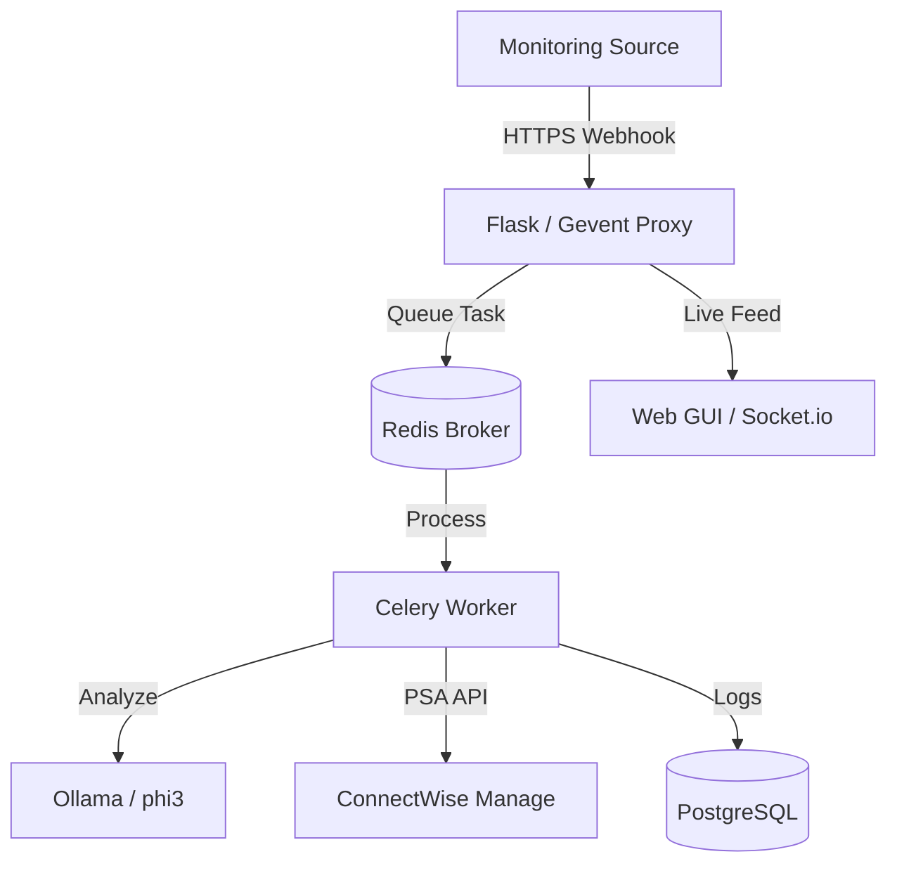

<p align="center">
  
</p>

# HookWise

**Enterprise-Grade Webhook Router & ConnectWise Bridge**

HookWise is a highly performant, general-purpose webhook router designed to bridge various monitoring sources (Uptime Kuma, Zabbix, Grafana, Datadog) to **ConnectWise Manage** tickets. Featuring intelligent duplicate detection, asynchronous processing, and local AI-driven analysis.

---

## 🏗️ Architecture & Flow

### System Overview
HookWise uses a distributed architecture to ensure reliability and low-latency webhook ingestion.



### Webhook Processing Pipeline
1.  **Ingestion**: Proxy receives payload, validates source IP and HMAC signature.
2.  **Queuing**: Request is assigned a `request_id` and pushed to Redis.
3.  **Processing**: Celery worker pulls the task.
4.  **Resolution**: JSONPath mappings and Regex routing rules are applied.
5.  **Deduplication**: PSA is queried for existing open tickets with the same summary.
6.  **Action**: Ticket is Created, Updated, or Closed in ConnectWise.
7.  **AI Insights**: For new tickets, Ollama generates an automated RCA note.

---

## 🚀 Advanced Features

### 🛠️ Intelligent Routing
- **Regex Rule Engine:** Route `CRITICAL` alerts to the "Emergency" board and `WARN` alerts to "Tiling" automatically.
- **Maintenance Awareness:** Define ISO8601 maintenance windows to suppress tickets during scheduled downtime.
- **Company Mapping:** Supports `#CW<ID>` in titles or dynamic lookups from payload fields.

### 🧠 AI-Powered Insights
HookWise can generate automated troubleshoot guides using local LLMs. It analyzes the raw payload and adds an **internal note** to the ticket with:
- Potential root causes.
- Suggested troubleshooting steps.
- Technical summary of the alert.

### 📋 Observability
- **Live Activity Hub:** Real-time Socket.io feed of all incoming webhooks.
- **Audit Trail:** Every configuration change is logged with the user and timestamp.
- **Prometheus Metrics:** Native Export for scrapers like Grafana.

---

## 📋 API Reference

All GUI/Admin endpoints require Session Auth or Basic Auth (if configured). Webhook endpoints require Bearer tokens.

### Webhook Ingestion
- `POST /webhook/<endpoint_id>`
  - **Auth**: `Authorization: Bearer <token>`
  - **Returns**: `202 Accepted` with `request_id`.

### Internal API (Admin)
- `GET /api/stats`: Returns daily performance data.
- `POST /history/replay/<log_id>`: Re-processes a historic webhook.
- `GET /api/cw/boards`: Cached proxy to ConnectWise boards.
- `GET /health/services`: Real-time health check for Redis, DB, and Celery.
- `POST /admin/maintenance`: Toggle global maintenance mode.

---

## ⚙️ Extensive Configuration

### PSA Integration
| Variable | Usage |
|----------|-------|
| `CW_TICKET_PREFIX` | Prefix for all summaries (Default: `Alert:`). |
| `CW_SERVICE_BOARD` | Primary board if not overridden. |
| `CW_STATUS_NEW` | Initial status for new tickets. |
| `CW_STATUS_CLOSED` | Status used when an `UP` alert is received. |

### System & Security
| Variable | Usage |
|----------|-------|
| `ENCRYPTION_KEY` | 32-byte Fernet key. **DO NOT LOSE.** |
| `GUI_TRUSTED_IPS`| CIDR list (e.g., `10.0.0.0/24, 192.168.1.5`). |
| `LOG_RETENTION_DAYS`| Auto-cleanup limit for `webhook_log` table. |
| `FORCE_HTTPS` | Redirects all traffic to TLS. |

---

## 📖 Deep-Dive Usage

### JSONPath Mapping Examples
| Destination | Path Example | Result |
|-------------|--------------|--------|
| **Summary** | `$.monitor.name` | Extracts Uptime Kuma monitor name. |
| **Description**| `$.msg` | Extracts the alert body. |
| **Company** | `$.tags.client_id` | Maps dynamic client IDs. |

### Placeholder Templates
Use these in your "Ticket Description Template":
- `{{ monitor_name }}`: The alert source name.
- `{{ msg }}`: The alert message.
- `{{ request_id }}`: Internal tracking ID.
- `{$..field}`: Any valid JSONPath (e.g., `{$..heartbeat.status}`).

### Web GUI Shortcuts
- ` / ` : Focus Search bar.
- `Esc` : Close any open modal.
- `Drag & Drop` : Reorder endpoint priority on the dashboard.

---

## 🛠️ Troubleshooting & FAQ

**Q: Why are tickets not closing automatically?**
- Verify that your `Close Value` in the endpoint config matches the payload exactly (e.g., `1` vs `UP`).
- Check if the ticket summary has been manually changed in ConnectWise.

**Q: "Redis connection refused" in logs?**
- Ensure the `redis` container is running and the `REDIS_PASSWORD` matches in both the `redis` and `hookwise` services.

**Q: AI RCA is too slow?**
- LLM inference is CPU-heavy. Ensure the `hookwise-llm` container has at least 4 cores and 8GB RAM assigned.

---

## 🛡️ Security & Compliance
- **Data Privacy**: Webhook payloads are masked (`********`) in audit logs if they contain sensitive keys like `token` or `password`.
- **Encryption**: Bearer tokens and HMAC secrets are encrypted using AES-128 via the Fernet protocol.
- **Air-Gap Support**: All assets (Bootstrap, Socket.io, Prism.js) are bundled locally. No external CDNs are used.

---

## 📄 Development & Contributing

### Linting & Formatting
We use `ruff` for code quality:
```bash
ruff check .
ruff format .
```

### Database Migrations
When changing `models.py`:
```bash
flask db migrate -m "Description"
flask db upgrade
```

---

## 📄 License
MIT License - Copyright (c) 2026 HookWise Team.


