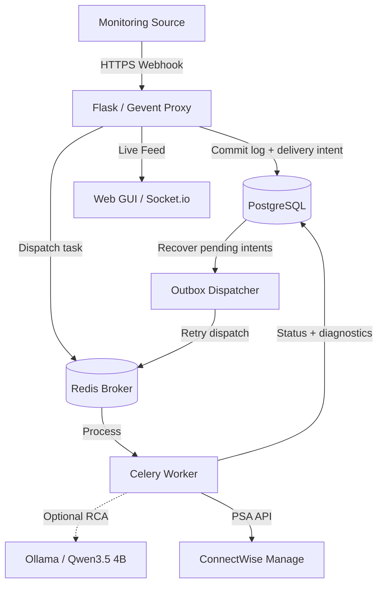
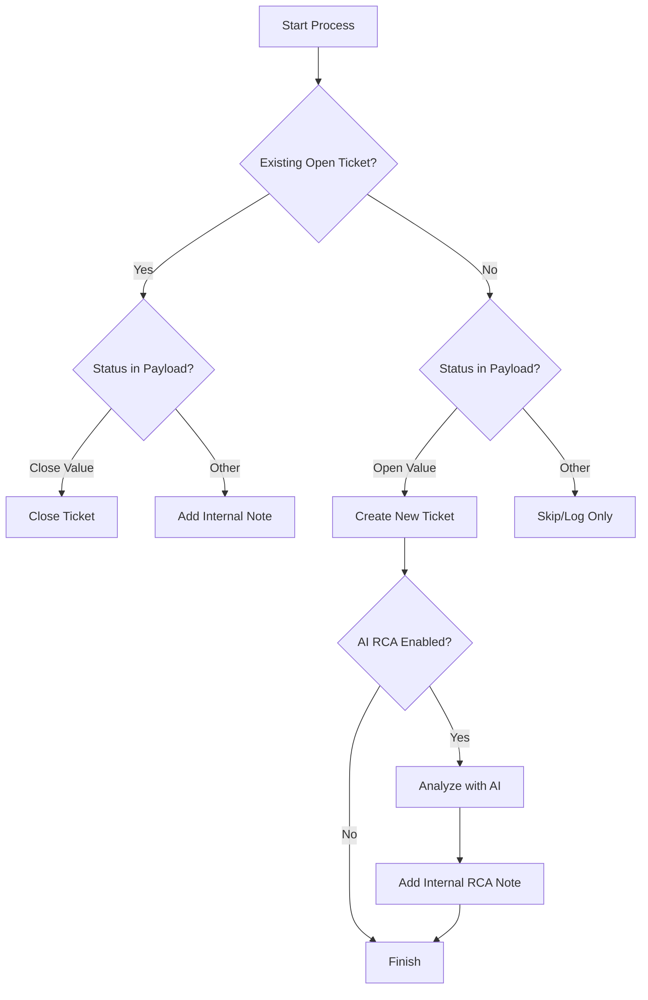
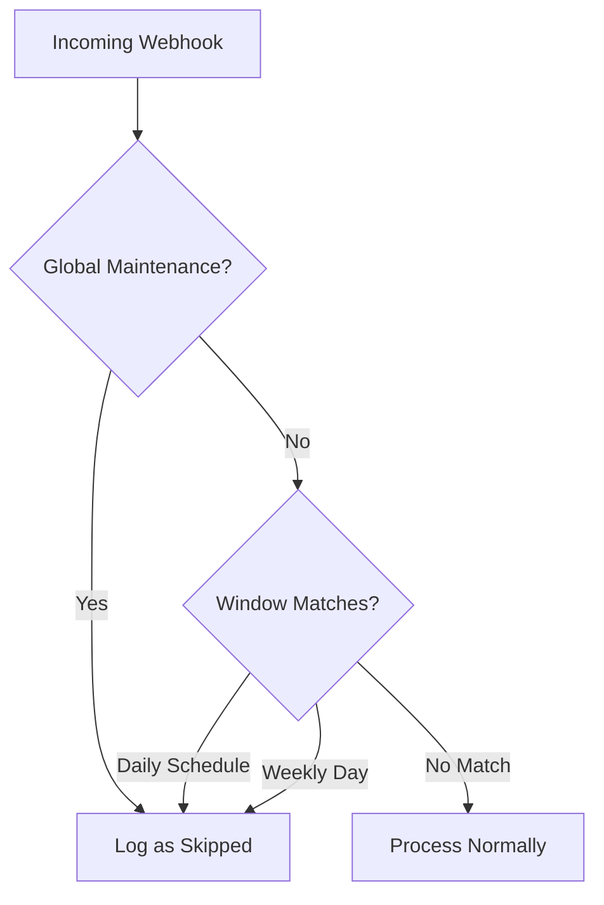
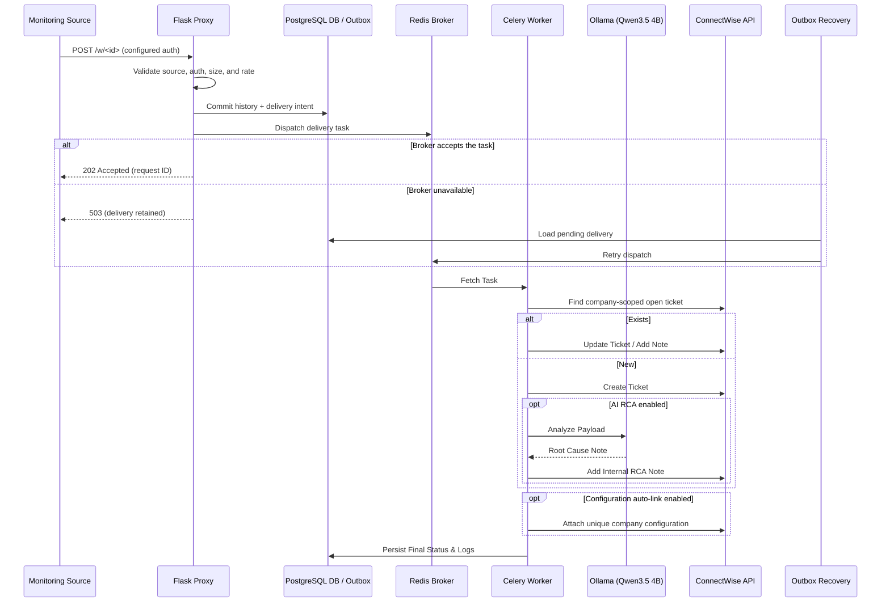

<p align="center">
  
</p>

# HookWise

[](https://github.com/arumes31/hookwise/actions/workflows/ci.yml)
[](https://www.python.org/)
[](https://github.com/astral-sh/ruff)
[](https://opensource.org/licenses/MIT)
[](https://www.docker.com/)

**Enterprise-Grade Webhook Router & ConnectWise Bridge**

HookWise is a high-performance webhook router that connects monitoring and security sources such as Uptime Kuma, Zabbix, Grafana, Datadog, and CIPP to **ConnectWise Manage** tickets. It provides company-aware duplicate detection, durable asynchronous delivery, optional local AI analysis, and configuration/asset association.

---

## 📍 Table of Contents

- [Quick Start](#-quick-start)
- [Architecture & Flow](#-architecture--flow)
- [Advanced Features](#-advanced-features)
- [Web Console](#-web-console)
- [API Reference](#-api-reference)
- [HMAC Security & Verification](#-hmac-security--verification)
- [AI In-Depth](#-ai-in-depth)
- [Extensive Configuration](#-extensive-configuration)
- [Deep-Dive Usage](#-deep-dive-usage)
- [Configuration Recipes](#-configuration-recipes)
- [Dynamic Company Identification](#-dynamic-company-identification)
- [ConnectWise Configuration Auto-Linking](#-connectwise-configuration-auto-linking)
- [Troubleshooting & FAQ](#-troubleshooting--faq)
- [Identity & Access (RBAC + Entra ID)](#-identity--access-rbac--entra-id)
- [Security & Compliance](#-security--compliance)
- [Development & Contributing](#-development--contributing)
- [License](#-license)

---

## ⚡ Quick Start

Requirements: Docker Engine with Docker Compose and ConnectWise Manage API credentials.

1. Copy `.env.example` to `.env` and replace every sample credential. Add a unique `POSTGRES_PASSWORD`; production also requires strong `SECRET_KEY`, `GUI_PASSWORD`, `REDIS_PASSWORD`, and valid Fernet `ENCRYPTION_KEY` values.
2. Review the selected Compose file before starting. `CW_URL`, `CW_COMPANY`, `CW_PUBLIC_KEY`, `CW_CLIENT_ID`, the default ticket settings, and several proxy/TLS settings are currently literal values in `docker-compose.yml` and `docker-compose.ghcr.yml`; edit or override them for your environment.
3. Start either a local source build or the published GHCR image:

   ```bash
   # Build from this checkout
   docker compose up -d --build

   # Or use the published image
   docker compose -f docker-compose.ghcr.yml up -d --pull always
   ```

4. For local HTTP-only evaluation, add `SESSION_COOKIE_SECURE=false` to the shared Compose environment, then open `http://localhost:5000` and sign in as `admin` with the configured `GUI_PASSWORD`. The one-shot `hookwise-migrate` service applies database migrations and bootstraps this account before the application services start.

Never deploy the sample passwords or keys. For production, place HookWise behind an HTTPS reverse proxy and keep secure session cookies enabled. If AI RCA is enabled, pull the default model once with `docker exec hookwise-llm ollama pull qwen3.5:4b`. See the [operator runbook](docs/RUNBOOK.md) for health checks, recovery, secret rotation, and DLQ procedures.

---

## 🏗️ Architecture & Flow

### System Overview

HookWise uses a distributed architecture to ensure reliability and low-latency webhook ingestion.


```mermaid
graph TD
    Client[Monitoring Source] -->|HTTPS Webhook| Proxy[Flask / Gevent Proxy]
    Proxy -->|Commit log + delivery intent| DB[(PostgreSQL)]
    Proxy -->|Dispatch task| Redis[(Redis Broker)]
    DB -->|Recover pending intents| Outbox[Outbox Dispatcher]
    Outbox -->|Retry dispatch| Redis
    Redis -->|Process| Worker[Celery Worker]
    Worker -.->|Optional RCA| AI[Ollama / Qwen3.5 4B]
    Worker -->|PSA API| CW[ConnectWise Manage]
    Worker -->|Status + diagnostics| DB
    Proxy -->|Live Feed| GUI[Web GUI / Socket.io]
```

### Webhook Processing Pipeline

1.  **Ingestion**: The proxy validates the endpoint, source IP, configured authentication, payload size, and rate limit.
2.  **Durable staging**: A request ID, history row, and delivery intent are committed together in PostgreSQL.
3.  **Queuing**: The delivery is dispatched to Redis/Celery; an outbox dispatcher recovers a committed intent if the broker was unavailable.
4.  **Resolution**: The worker applies JSONPath mappings, regex routing rules, maintenance windows, and final company selection.
5.  **Deduplication**: HookWise checks its endpoint/company/summary cache and revalidates a matching open ticket within the resolved ConnectWise company as needed.
6.  **Action**: The ticket is created, updated, or closed in ConnectWise.
7.  **Asset association**: When enabled, HookWise attaches one exact, active ConnectWise configuration belonging to the assigned company.
8.  **AI insights**: For new tickets on endpoints with AI RCA enabled, Ollama generates an internal RCA note.

#### 🔄 Ticket Management Logic


```mermaid
flowchart TD
    A[Start Process] --> B{Existing Open Ticket?}
    B -- Yes --> C{Status in Payload?}
    C -- "Close Value" --> D[Close Ticket]
    C -- Other --> E[Add Internal Note]
    B -- No --> F{Status in Payload?}
    F -- "Open Value" --> G[Create New Ticket]
    F -- Other --> H[Skip/Log Only]
    G --> I{AI RCA Enabled?}
    I -- Yes --> J[Analyze with AI]
    J --> K[Add Internal RCA Note]
    I -- No --> L[Finish]
    K --> L
```

#### 🛡️ Maintenance Suppression Flow


```mermaid
flowchart TD
    A[Incoming Webhook] --> B{Global Maintenance?}
    B -- Yes --> C[Log as Skipped]
    B -- No --> D{Window Matches?}
    D -- "Daily Schedule" --> C
    D -- "Weekly Day" --> C
    D -- No Match --> E[Process Normally]
```

#### ⛓️ The Life of a Webhook (Sequence)


```mermaid
sequenceDiagram
    participant S as Monitoring Source
    participant P as Flask Proxy
    participant D as PostgreSQL DB / Outbox
    participant R as Redis Broker
    participant W as Celery Worker
    participant A as Ollama (Qwen3.5 4B)
    participant C as ConnectWise API
    participant O as Outbox Recovery

    S->>P: POST /w/<id> (configured auth)
    P->>P: Validate source, auth, size, and rate
    P->>D: Commit history + delivery intent
    P->>R: Dispatch delivery task
    alt Broker accepts the task
        P-->>S: 202 Accepted (request ID)
    else Broker unavailable
        P-->>S: 503 (delivery retained)
        O->>D: Load pending delivery
        O->>R: Retry dispatch
    end
    
    R->>W: Fetch Task
    W->>C: Find company-scoped open ticket
    alt Exists
        W->>C: Update Ticket / Add Note
    else New
        W->>C: Create Ticket
        opt AI RCA enabled
            W->>A: Analyze Payload
            A-->>W: Root Cause Note
            W->>C: Add Internal RCA Note
        end
    end
    opt Configuration auto-link enabled
        W->>C: Attach unique company configuration
    end
    W->>D: Persist Final Status & Logs
```

---

## 🚀 Advanced Features

### 🛠️ Intelligent Routing

- **Regex Rule Engine:** Route `CRITICAL` alerts to the "Emergency" board and `WARN` alerts to "Tiling" automatically.
- **Smart Maintenance:** Define recurring maintenance windows (Daily, Weekly, Once) with support for overnight schedules (e.g., 22:00 to 04:00) using UTC-normalized logic.
- **Company Mapping:** Supports `#CW<ID>` in titles or dynamic lookups from payload fields.
- **Webhook Timeout Alerts (Heartbeat):** Automatically trigger a ticket if an endpoint hasn't received data within a configured threshold (e.g., "No data for 24h"). Alerts repeat at the same hourly interval if the endpoint remains stale, adding a note to the existing ticket or creating a new one if it was closed. The alert state resets as soon as the next webhook arrives.

### 📦 Reliable Delivery

- **Transactional outbox:** HookWise commits the webhook history row and dispatch intent together. If Redis is unavailable, the request returns `503`, but the committed delivery remains available for automatic outbox recovery.
- **Per-endpoint controls:** Configure an ingress limit, bounded retry count, initial delay, and maximum delay. Retryable failures use jittered exponential backoff.
- **Dead-letter queue:** Exhausted or non-retryable deliveries enter the DLQ with attempt lineage and error context for operator review and replay.
- **Failure thresholds:** Optionally notify the configured system health webhook when an endpoint reaches a defined number of failures within a time window.

### 🧠 AI-Powered Insights

HookWise can generate automated troubleshooting guides using local LLMs. It analyzes the raw payload and adds an **internal note** to the ticket with:

- Potential root causes.
- Suggested troubleshooting steps.
- Technical summary of the alert.

**Managing the Model:**
By default, HookWise uses `qwen3.5:4b`. Pull or update it manually with:
```bash
docker exec -it hookwise-llm ollama pull qwen3.5:4b
```

### 📋 Observability

- **Live Activity Hub:** Filterable real-time Socket.IO feed with pause/resume, bounded buffers, duplicate suppression, persistent annotations, and reconnect handling.
- **Safe lifecycle controls:** Endpoint archive/restore is reversible and CSRF-protected; restored endpoints remain paused until reviewed.
- **Audit trail:** Key endpoint, identity, access-control, and administrative mutations are recorded with the actor and timestamp.
- **Metrics and health:** Authenticated Prometheus metrics plus public container probes and authenticated dependency diagnostics.

---

## 🖥️ Web Console

### Operations Dashboard

The dashboard provides drill-down KPIs, comparison deltas, endpoint activity, and timezone-aware event charts with failure rates and P50/P95/P99 latency. Operators can select preset or custom time ranges, refresh manually or automatically, hide and reorder KPIs, and use compact mode. Layout, timezone, refresh interval, and activity-buffer preferences are stored per user.

### Endpoint Management

- Search and filter by name, URL, board, company, health, state, tags, or the safe last four characters of a token. Switch between list and grid views, sort/group results, and pin or drag endpoints into priority order.
- Create drafts, clone configurations, queue a realistic test webhook, preview routing without calling ConnectWise, rotate bearer tokens, and import or export endpoint JSON. Single-endpoint exports omit bearer and HMAC secrets; imports receive a fresh ID/token and start paused.
- Apply bulk board/priority changes, pause, resume, archive, or export selected endpoints. Archived endpoints preserve their configuration and history and can be restored.
- The editor progressively hydrates ConnectWise board/status/type data while preserving saved selections. Unsaved non-secret form fields are restored locally after a reload; secret, file, and hidden fields are never placed in that draft cache.

### History and Replay

History includes basic and advanced filters, saved searches, live tail, retry/DLQ state, ConnectWise quota and endpoint rate-limit context, and bulk actions. Secret-safe diagnostics show the processing timeline, error chain, and retry attempts without including stored payloads or request headers in downloads. Failed deliveries can be retried, replayed with an edited JSON payload, or replayed from the DLQ in batches of up to 50.

### Settings and Recovery

Settings covers retention, system health notifications, CIPP exclusions, ConnectWise lookup-cache refresh, LLM diagnostics, and local TOTP setup. Configuration backup/restore produces an encrypted, authenticated file containing endpoints (including delivery secrets), tags, tenant mappings, and user dashboard preferences.

> [!IMPORTANT]
> A configuration backup is not a PostgreSQL, webhook-history, audit-log, or user-account backup. Restoring it on another installation requires the same `ENCRYPTION_KEY`; protect that key separately. Uploads are limited to 5 MiB, and the web-console restore action requires `settings:write`.

---

## 📋 API Reference

GUI and administrative APIs require an authenticated browser session or configured HTTP Basic Auth. Browser sessions are subject to RBAC, and state-changing browser requests are CSRF-protected. Basic Auth is intended for trusted headless clients, must name an active HookWise account, and should be restricted with `GUI_TRUSTED_IPS`.

> [!CAUTION]
> Treat the configured Basic Auth credential as privileged automation access, not as a least-privilege replacement for an interactive RBAC session.

Webhook authentication is configured per endpoint: Bearer and HMAC may be used independently or together; when both are configured, both must validate. Disabling both is rejected unless **Explicitly allow unauthenticated delivery** is enabled. Trusted-IP/CIDR restrictions and per-endpoint rate limits apply independently of the authentication mode.

### Webhook Ingestion

- `POST /w/<endpoint_id>`
  - **Auth**: Configured Bearer token and/or HMAC signature; unauthenticated ingestion must be explicitly opted into.
  - **Returns**: `202 Accepted` with `request_id` after dispatch, validation/authentication errors as `4xx`, or `503` when broker dispatch failed and the delivery was retained in the durable outbox.

### Authenticated Operations APIs

- **Dashboard:** `GET /api/stats`, `GET /api/stats/history`, `GET /api/dashboard/overview`, `GET /api/dashboard/analytics`, and `GET|PATCH|DELETE /api/dashboard/preferences`.
- **Endpoint telemetry:** `GET /api/endpoints/summary`, including optional secret-safe token-suffix matching.
- **Activity:** `GET /api/activity/stream` and `PUT|DELETE /api/activity/events/<log_id>/annotation`.
- **History:** `GET /api/history/advanced`, `GET|POST /api/history/saved-searches`, `GET /api/history/<log_id>/diagnostics`, `POST /api/history/<log_id>/retry`, `POST /api/history/<log_id>/replay-edits`, `POST /api/history/dlq/replay`, and `GET /api/history/operations`.
- **ConnectWise lookups:** Cached board, priority, status, type, subtype, item, and company lists under `/api/cw/*`.
- **Endpoint validation:** `POST /endpoint/test/<config_id>` queues a real test delivery; `POST /endpoint/dry-run/<config_id>` previews maintenance and routing decisions without calling ConnectWise.
- **Administration:** `POST /admin/maintenance`, `GET /admin/backup`, and `POST /admin/restore`.

### Health and Metrics

- `GET /health` and `GET /readyz` are deliberately unauthenticated container probes.
- `GET /health/services` reports Redis, PostgreSQL, and Celery state; browser-session access requires `settings:read`.
- `GET /health/llm` and `GET /api/health/llm` report Ollama health; browser-session access requires `settings:read`.
- `GET /metrics` exports Prometheus metrics and requires authentication; use an active Basic Auth account for a headless scraper.

---

## 🔒 HMAC Security & Verification

HMAC (Hash-based Message Authentication Code) provides a way to verify both the **integrity** and the **authenticity** of a webhook. It ensures that the payload hasn't been tampered with and truly originated from your monitoring tool.

### How it Works

1.  **Shared Secret**: You and HookWise share a secret key (configured per endpoint).
2.  **Signing**: Sign `<unix_timestamp>.<unique_nonce>.<raw_request_body>` with HMAC-SHA256.
3.  **Transmission**: Send the signature, timestamp, and nonce headers.
4.  **Verification**: HookWise verifies the signature, rejects timestamps outside five minutes, and accepts each nonce once.

### Implementation Guide (How-to)

If your monitoring tool supports custom headers and signing scripts, use the following logic:

**1. Calculate the Signature** (Python Example):
```python
import hmac
import hashlib
import secrets
import time

secret = "your_hmac_secret_from_gui"
payload = b'{"status": "0", "msg": "Critical Alert"}'
timestamp = str(int(time.time()))
nonce = secrets.token_urlsafe(24)
signed_payload = timestamp.encode() + b"." + nonce.encode() + b"." + payload

signature = hmac.new(secret.encode(), signed_payload, hashlib.sha256).hexdigest()
```

**2. Send the Request**:
- **Header**: `X-HookWise-Signature: <calculated_signature>`
- **Header**: `X-HookWise-Timestamp: <unix_timestamp>`
- **Header**: `X-HookWise-Nonce: <unique_random_value>`
- **Content-Type**: `application/json`

> [!IMPORTANT]
> Always sign the **raw, unformatted** body. If your tool beautifies the JSON (adds spaces/newlines) after signing, the verification will fail.

---

## 🧠 AI In-Depth

HookWise uses **Ollama** for optional RCA (Root Cause Analysis). The supplied Compose files point `OLLAMA_HOST` at the local `hookwise-llm` container, so no third-party LLM is used by default. If you configure a remote Ollama host, payload-derived prompts leave the HookWise host and must be handled according to your data policy.

### Model Customization

By default, HookWise uses `qwen3.5:4b`. You can swap this for `phi4-mini`, `llama3.2`, or another model supported by Ollama:

1. **Pull the model**:
   ```bash
   docker exec -it hookwise-llm ollama pull phi4-mini
   ```
2. **Update Configuration**: Set the `AI_MODEL` environment variable to `phi4-mini`.
3. **Restart Worker**: The Celery worker will now use the new model for all analysis.

`AI_MODEL` is read by every LLM request. Set it on both proxy and worker deployments when they do not share the Compose environment block.

Qwen3.5 uses reasoning mode by default. HookWise sets `LLM_THINK=false` so the configured output-token budget is used for the ticket note rather than an internal reasoning trace. For unusually complex alerts, enable thinking and increase `LLM_MAX_TOKENS` to at least `1536`; expect higher CPU latency. `LLM_CONTEXT_LENGTH` defaults to `4096`, which is sufficient for alert payloads while limiting CPU memory usage.

### Endpoint templates

The new-endpoint page includes presets for Uptime Kuma, Zabbix, Grafana, Datadog, and CIPP. A preset only pre-fills routing defaults; review authentication and ConnectWise fields before saving.

### The RCA System Prompt

Live ticket RCA uses HookWise's concise default system prompt and asks for three likely causes plus three troubleshooting steps. The endpoint editor's **RCA Instructions** field is currently applied to the built-in LLM dry-run test; live ticket notes continue to use the default prompt.

### 🎚️ Tuning Output Length (`LLM_MAX_TOKENS`)

The `LLM_MAX_TOKENS` environment variable controls how many tokens Ollama is allowed to generate per RCA response. If your notes appear **cut off mid-sentence**, this value is too low.

| Value | Expected Output | Best For |
|-------|----------------|----------|
| `100` | 1–2 sentences; often truncated | Smoke tests only |
| `256` | Short response; complex alerts may truncate | Strict latency limits |
| `512` *(default)* | Complete, concise RCA for most alerts | Most deployments |
| `1024` | More detailed analysis with higher latency | Complex alerts |
| `2048` | Very long output with substantially higher latency | Exceptional investigations |

> [!TIP]
> Start with `LLM_MAX_TOKENS=512`. Generation time and memory use depend on the model, context length, quantization, and hardware; benchmark changes on the host that runs Ollama.

> [!NOTE]
> Token ≠ word. Roughly 1 token ≈ 0.75 words. `512` tokens ≈ ~380 words — enough for a complete, structured RCA note.

---

## ⚙️ Extensive Configuration

### PSA Integration

| Variable | Usage |
|----------|-------|
| `CW_URL` | ConnectWise Manage REST API base URL. |
| `CW_COMPANY` | Integrator/company identifier used to build ConnectWise authentication. |
| `CW_PUBLIC_KEY` / `CW_PRIVATE_KEY` | ConnectWise API member credentials. Treat the private key as a secret. |
| `CW_CLIENT_ID` | ConnectWise integration client ID. |
| `CW_DEFAULT_COMPANY_ID` | Fallback ticket company when routing does not resolve a customer. |
| `CW_TICKET_PREFIX` | Prefix for all summaries (Default: `Alert:`). |
| `CW_SERVICE_BOARD` | Primary board if not overridden. |
| `CW_STATUS_NEW` | Initial status for new tickets. |
| `CW_STATUS_CLOSED` | Status used when an `UP` alert is received. |
| `CW_CONNECT_TIMEOUT` / `CW_READ_TIMEOUT` | ConnectWise HTTP connect/read timeouts in seconds (Defaults: `5` / `30`). |
| `VIABILITY_TTL` | Seconds a ticket is cached as "open" before re-checking ConnectWise (Default: `300`). |

### System & Security

| Variable | Usage |
|----------|-------|
| `SECRET_KEY` | Flask session-signing secret. Required outside debug mode. |
| `ENCRYPTION_KEY` | 32-byte Fernet key. **DO NOT LOSE.** |
| `RBAC_ENFORCE` | Role enforcement: `on` (default), `log` (check + log only), `off`. See [Identity & Access](#-identity--access-rbac--entra-id). |
| `ENTRA_*` | Microsoft Entra ID sign-in — see [Identity & Access](#-identity--access-rbac--entra-id). |
| `GUI_USERNAME` / `GUI_PASSWORD` | Basic-auth credentials for trusted headless clients. The username must belong to an **active HookWise account**; pair this with `GUI_TRUSTED_IPS`. |
| `GUI_TRUSTED_IPS` | Optional global IP/CIDR allowlist for authenticated GUI and administrative routes (e.g., `10.0.0.0/24, 192.168.1.5`). |
| `LOG_RETENTION_DAYS` | Auto-cleanup limit for the `webhook_log` table. |
| `SESSION_COOKIE_SECURE` | Send the session cookie only over HTTPS (Default: `true` outside tests). Disable only for local HTTP development. |
| `MAX_CONTENT_LENGTH_KB` | Maximum inbound request size before a `413` response (Default: `1024`). |
| `FORCE_HTTPS` | Redirects all traffic to TLS. Requires `HTTPS_ORIGIN`. |
| `HTTPS_ORIGIN` | Trusted public HTTPS origin used for redirects (for example, `https://hookwise.example.com`). |
| `USE_PROXY` / `PROXY_FIX_COUNT` | Trust reverse-proxy forwarding headers and set the exact trusted proxy hop count. |
| `ENABLE_HSTS` | Emit the one-year HSTS header (Default: `true`; meaningful only over HTTPS). |
| `CELERY_TASK_SOFT_TIME_LIMIT` / `CELERY_TASK_TIME_LIMIT` | Worker soft/hard task limits in seconds (Defaults: `120` / `300`). |
| `OLLAMA_HOST` | Ollama API base URL (Compose default: local `hookwise-llm`). |
| `LLM_MAX_TOKENS` | Max tokens for LLM RCA responses (Default: `512`). Increase if output is truncated. |
| `LLM_CONTEXT_LENGTH` | Ollama context allocation per request (Default: `4096`). Increase only for unusually large payloads. |
| `LLM_THINK` | Enable Qwen3.5 reasoning before its response (Default: `false`). Increase the token limit when enabled. |
| `LLM_TIMEOUT` | Seconds to wait for LLM inference (Default: `900`, or 15 minutes). Background tasks and diagnostics include additional shutdown grace. |

See [`.env.example`](.env.example) for the configuration template and the [operator runbook](docs/RUNBOOK.md#configuration--limits-env) for production limits and recovery guidance. Compose interpolates only `${...}` entries; edit or override any literal environment values in the selected Compose file.

---

## 📖 Deep-Dive Usage

### JSONPath Mapping Examples

| Destination | Path Example | Result |
|-------------|--------------|--------|
| **Summary** | `$.monitor.name` | Extracts Uptime Kuma monitor name. |
| **Description**| `$.msg` | Extracts the alert body. |
| **Company** | `$.tags.client_id` | Maps dynamic client IDs. |

#### 🔗 Multi-Variable Mapping

HookWise supports combining multiple JSONPath variables in a single field. Simply space-separate the paths. Empty or null variables in the payload will be automatically ignored. Any segment not starting with `$` is treated as **literal text**.

> [!NOTE]
> The field will only be overridden if **at least one** JSONPath resolves to a non-empty value. Literal-only results are ignored to prevent accidental data loss.

- **Example Mapping**: `"summary": "$.TaskInfo.Tenant $.TaskInfo.Name"`
- **Payload 1**: `{"TaskInfo": {"Tenant": "Acme", "Name": "SRV01"}}` -> **Result**: `Acme SRV01`
- **Payload 2**: `{"TaskInfo": {"Name": "SRV01"}}` -> **Result**: `SRV01`
- **Payload 3**: `"summary": "Prefix $.SomePath"` where `$.SomePath` is missing -> Result: **No Override** (Default monitor name is used).
- **Payload 4**: `"summary": "Prefix $.SomePath"` where `$.SomePath` exists -> Result: `Prefix Value`

### Placeholder Templates

Use these in your "Ticket Description Template":
- `{{ monitor_name }}`: The alert source name.
- `{{ msg }}`: The alert message.
- `{{ request_id }}`: Internal tracking ID.
- `{{ cipp_results }}`: Readable English rendering of every item in a CIPP `Results` array.
- `{$..field}`: Any valid JSONPath (e.g., `{$..heartbeat.status}`).

To suppress certificate-expiry tickets for specific enterprise applications globally, open **Settings > General
Configuration** and enter one exact name or glob pattern per line under **CIPP Certificate Expiry Exclusions**.
Matching is case-insensitive and supports `*` and `?` wildcards. Excluded items are removed before formatting. A
webhook containing only excluded applications is recorded as skipped and does not create or update a ConnectWise
ticket.

Example universal CIPP template:
```text
CIPP Alert

Tenant: {$.Tenant}
Alert: {$.TaskInfo.Name}
Source: {$.TaskInfo.Command}
Hookwise Request ID: {{ request_id }}

{{ cipp_results }}
```

### Web GUI Shortcuts

- ` / ` : Focus Search bar.
- `Esc` : Close any open modal.
- `Drag & Drop` : Reorder endpoint priority on the dashboard.

---

## 🚀 Configuration Recipes

### 1. Uptime Kuma (Standard)

Perfect for basic UP/DOWN monitoring.

- **Trigger Field**: `$.heartbeat.status`
- **Open Value**: `0`
- **Close Value**: `1`
- **JSON Mapping**:
  ```json
  {
    "summary": "$.monitor.name",
    "description": "$.heartbeat.msg",
    "customer_id": "$.monitor.tags.CW_ID"
  }
  ```

### 2. Generic Status Webhook

For tools that send text-based statuses like "CRITICAL" or "OK".

- **Trigger Field**: `$.status_text`
- **Open Value**: `CRITICAL, WARNING`
- **Close Value**: `OK, RESOLVED`
- **Ticket Prefix**: `Infrastructure Alert:`

### 3. Advanced Regex Routing

Route alerts to different boards based on the hostname.

- **Routing Rules**:
  ```json
  [
    {
      "path": "$.monitor.hostname",
      "regex": ".*-DB-.*",
      "overrides": {
        "board": "Database Team",
        "priority": "High"
      }
    },
    {
      "path": "$.monitor.hostname",
      "regex": ".*-FE-.*",
      "overrides": {
        "board": "Frontend Team"
      }
    }
  ]
  ```

### 4. Zabbix (Enterprise)

Great for detailed system health and event severity.

- **Trigger Field**: `$.event.status`
- **Open Value**: `PROBLEM`
- **Close Value**: `OK, RESOLVED`
- **JSON Mapping**:
  ```json
  {
    "summary": "$.event.name",
    "severity": "$.event.severity",
    "description": "Trigger: {$.trigger.description}\nHost: {$.host.name}"
  }
  ```

### 5. Grafana Alertmanager

Handle firing and resolved alerts from Grafana dashboards.

- **Trigger Field**: `$.status`
- **Open Value**: `firing`
- **Close Value**: `resolved`
- **JSON Mapping**:
  ```json
  {
    "summary": "$.alerts[0].annotations.summary",
    "description": "$.alerts[0].annotations.description"
  }
  ```

---

## 🏢 Dynamic Company Identification

HookWise provides several ways to automatically map alerts to the correct ConnectWise Client without creating separate endpoints for every customer.

### 1. The "#CW" Magic String (Simplest)

If your monitor name contains `#CW` followed by a ConnectWise Company Identifier, HookWise will automatically route the ticket to that company.
- **Example Monitor Name**: `Firewall Down #CW-AcmeCorp`
- **Result**: Ticket created for company `AcmeCorp`.

### 2. JSONPath Mapping

Map a specific field in the webhook payload directly to the ConnectWise company ID.
- **Mapping**: `"customer_id": "$.tags.client_id"`

### 3. Regex Overrides

Use Routing Rules to map specific hostnames or message patterns to different companies.
- **Rule**: `{"path": "$.host", "regex": "PRD-CL1-.*", "overrides": {"customer_id": "CLIENT_A"}}`

### 4. TenantMap (Global Routing)

HookWise provides a centralized mapping table called **TenantMap** (found in the navbar). This allows you to map common client identifiers (like domains or company IDs) once and apply them globally across all your endpoints.

- **Centralized Link**: Map `example.com` -> `EXAMPLE` just once.
- **Auto-Scanning**: HookWise intelligently scans incoming payloads for fields like `Tenant`, `tenantId`, and `$.TaskInfo.Tenant`.
- **Per-Endpoint Toggle**: You can enable or disable TenantMap lookups for each specific endpoint in its configuration form.

> [!TIP]
> Use TenantMap for high-volume client identification to avoid repeating the same mapping rules in dozens of different endpoint configurations.

---

## 🔗 ConnectWise Configuration Auto-Linking

After HookWise resolves the ticket's final company, it can associate the ticket with a matching ConnectWise **configuration** (asset). Enable **Automatically link matching ConnectWise configuration** on an endpoint to opt in; the feature is disabled by default, including for older backups and cloned endpoints.

HookWise looks for exact identifiers in explicit mappings, common payload fields, the generated ticket title, and the rendered description:

- ConnectWise configuration ID or device ID
- Serial number, MAC address, or tag/asset number
- IP address, including addresses found inside URLs or written with a port/protocol suffix
- Configuration, host, or device name

For example, both `10.70.10.20:7090/tcp` and `http://10.70.10.20:7090/products/...` produce the IP candidate `10.70.10.20`. If exactly one active configuration belonging to the ticket's assigned company has that IP, HookWise attaches it to the new or existing ticket. The port is intentionally not part of the configuration match.

Use these optional JSON mapping destinations when a payload has known authoritative fields:

| Destination | Meaning |
|-------------|---------|
| `configuration_id` | ConnectWise configuration ID |
| `configuration_device_id` | Device identifier |
| `configuration_serial` | Serial number |
| `configuration_mac` | MAC address |
| `configuration_tag` | Tag or asset number |
| `configuration_ip` | IP address, URL, or address with an optional port/protocol |
| `configuration_name` | Configuration, host, or device name |

Matching is deliberately conservative: only active configurations from the exact assigned company are eligible, and ambiguous, conflicting, malformed, inactive, or cross-company results are skipped. Attachment is idempotent and best-effort, so lookup or attachment errors are recorded in webhook history without failing ticket processing.

> [!WARNING]
> A ConnectWise configuration association can affect agreement or SLA selection. Test the endpoint with representative payloads before enabling this feature in production.

---

## 🛠️ Troubleshooting & FAQ

**Q: Why are tickets not closing automatically?**
- Verify that your `Close Value` in the endpoint config matches the payload exactly (e.g., `1` vs `UP`).
- Check if the ticket summary has been manually changed in ConnectWise.

**Q: "Redis connection refused" in logs?**
- Ensure the `redis` container is running and the `REDIS_PASSWORD` matches in both the `redis` and `hookwise` services.

**Q: AI RCA is too slow?**
- LLM inference is CPU-heavy. Ensure the `hookwise-llm` container has at least 4 cores and 8GB RAM assigned.
- Consider switching to a smaller model (e.g., `llama3.2:3b` instead of larger variants).

**Q: Getting "400 Bad Request" when creating tickets?**
- This usually means ConnectWise rejected the payload due to a missing or invalid field.
- **Check History**: The History page shows the exact redacted error returned by ConnectWise in the Error Message column.
- Common causes: Invalid `board`, `priority`, or `status` name that doesn't exist on the target board.

**Q: Why was no ConnectWise configuration attached?**
- Confirm that auto-linking is enabled for the endpoint and that the ticket resolved to the expected company.
- HookWise requires one exact, active match in that company. Multiple configurations sharing an IP/name, conflicting identifiers, inactive assets, or cross-company results are intentionally skipped.
- Open the webhook's History diagnostics and inspect its configuration-link status for `no_identifiers`, `no_match`, `ambiguous`, `conflict`, or an API error.

**Q: Metrics at `/metrics` are missing some counters?**
- If you don't see `hookwise_webhooks_total` or other custom metrics, ensure your **Celery worker** and **Web proxy** can both reach the same Redis instance.
- HookWise uses Redis to aggregate metrics across process boundaries; if Redis is down or partitioned, counters will restart at zero or appear empty.

**Q: HMAC verification fails on every request?**
- Ensure your monitoring tool is sending the payload as raw JSON.
- If your tool adds extra whitespace or re-orders JSON keys after signing, the signature won't match.
- Ensure all three HMAC headers are present, the timestamp is within five minutes, and every request uses a fresh nonce.

---

## 🔐 Identity & Access (RBAC + Entra ID)

HookWise ships a role-based access model and optional Microsoft Entra ID
single sign-on. Users, roles, permissions, provisioning, and Entra bindings are
managed on the **Identity** page (`/settings/identity`, requires `user:read`).
Each local user manages their own authenticator-app TOTP under **Settings**.

### Roles & permissions

Permissions follow the `resource:action` scheme (17 keys, defined in
`hookwise/rbac/catalog.py` — the code is the single source of truth). Three
built-in roles are seeded and kept up to date automatically:

| Role | Grants |
|------|--------|
| `admin` | All 17 permissions, including user management and system settings. |
| `operator` | Day-to-day operations **including delivery credentials** (`secret:reveal`, `secret:rotate`), endpoint write/archive/test, replay, tenant mapping, audit — no user management, no settings writes, no history deletion. |
| `viewer` | Read-only: dashboard, endpoints, history, tenant map, settings view. |

Custom roles can be created in the permission matrix. Each user holds exactly
one role (assigned via the Identity page). Accounts still carrying only the
legacy `role` column behave as before: `admin` → admin, `user`/`operator` →
operator, `viewer` → viewer. Revoking a role takes effect on the next request
(permissions epoch), not the next login. The UI hides actions the session
lacks; secrets stay visible but locked, so their existence remains auditable.

### Enforcement modes (`RBAC_ENFORCE`)

| Mode | Behaviour |
|------|-----------|
| `on` *(default)* | Denied requests get a 403 (JSON for APIs, a 403 page for views). |
| `log` | Checks and logs `RBAC(log)` warnings, but never blocks — rollout/diagnosis stage. |
| `off` | No permission checks (pre-RBAC behaviour). |

The routes that always enforced their own boundary (secret reveal/rotate,
replay, history operations) keep blocking in **every** mode.

No database migration is required: an idempotent schema bridge creates the
RBAC tables and user columns at startup (Postgres advisory lock, safe with
multiple containers booting in parallel).

### Local two-factor authentication

Local accounts can enroll or disable time-based one-time password (TOTP) authentication under **Settings > Two-Factor Auth** by scanning a QR code with a standard authenticator app. TOTP secrets are encrypted at rest. An administrator can reset another user's enrollment on the Identity page; that user signs in with only their password until they enroll again. Entra accounts delegate MFA to Microsoft and do not use HookWise TOTP.

### Microsoft Entra ID sign-in

Configured entirely through the environment; without it the Entra routes stay
inert and local login is unchanged.

| Variable | Usage |
|----------|-------|
| `ENTRA_ENABLED` | `true` activates the sign-in button and callback routes. |
| `ENTRA_TENANT_ID` / `ENTRA_CLIENT_ID` | App registration (single tenant; the tenant is verified on every login). |
| `ENTRA_REDIRECT_URL` | Must match the registration, e.g. `https://host/auth/entra/callback`. |
| `ENTRA_CLIENT_SECRET_FILE` | Path to a mounted secret file — the secret never lives in env or DB. |
| `ENTRA_SCOPES` | Default `openid profile email`. |
| `ENTRA_AUTO_PROVISION` / `ENTRA_AUTO_PROVISION_ROLE` | Start values only; the runtime switch on the Identity page (stored in Redis) takes precedence. |

An optional **group filter** (Identity page) restricts sign-in to members of one
Entra group. It is enforced fail-closed: with a filter set, a token that carries
no matching `groups` claim is refused, so the app registration must be
configured to emit group claims (optional claims → groups).

Two provisioning modes, switchable at runtime on the Identity page:
**pre-provisioned only** (an account must exist here; it binds to the Entra
object on first sign-in) or **automatic** (any user the tenant assigns gets an
account with the chosen start role — roles holding privileged permissions such
as `secret:*` or `user:manage` are rejected as start roles, so auto-provisioning
can never create an administrator). Only the stable `tid`/`oid` pair is stored,
never tokens. Entra accounts have no local password or app MFA — both are
Microsoft's job — and their UPN is frozen while bound (clear the binding on the
Identity page to edit it).

### User management

Each row on the Identity page expands into a management panel: rename,
set a new password (local accounts, min. 8 characters), reset MFA (shown only
when enrolled), clear the Entra binding, enable/disable and delete. Two
invariants are enforced server-side: the last active holder of `user:manage`
cannot be deactivated or deleted, and you cannot delete your own account.

**Note for headless/API clients:** HTTP Basic Auth authenticates against
`GUI_USERNAME`/`GUI_PASSWORD` and requires an **active HookWise account with
that username**. Treat it as a trusted automation credential and restrict its
source addresses with `GUI_TRUSTED_IPS`.

---

## 🛡️ Security & Compliance

- **Data handling**: Webhook payloads are retained in history for troubleshooting. Values under recognized sensitive keys such as `token` and `password` are masked in history/API representations and live activity events; database access must still be treated as sensitive.
- **Encryption**: Bearer tokens and HMAC secrets are encrypted using AES-128 via the Fernet protocol.
- **Secure Identifiers**: Uses high-entropy, 64-character URL-safe tokens for endpoint IDs to prevent brute-force discovery.
- **Air-Gap Support**: All assets (Bootstrap, Socket.io, Prism.js) are bundled locally. No external CDNs are used.
- **Content-versioned assets**: Every local static file receives a 12-character SHA-256 content version at application startup. Current versioned URLs are cached as immutable for one year, while stale or unversioned assets revalidate; dynamic and protected responses use no-store/no-cache headers.

---

## 📄 Development & Contributing

### Linting & Formatting

We use `ruff` for code quality:

```bash
ruff check .
ruff format .
```

Run the full local quality suite before opening a pull request:

```bash
ruff check .
ruff format --check .
mypy .
pytest tests/ -v
python -m pip_audit -r requirements.txt
flask db check
```

CI runs these checks with Python 3.14.7 against PostgreSQL and Redis. Dependencies are installed from the hash-pinned `requirements-dev.txt` file.

### Database Migrations

When changing `models.py`:

```bash
flask db migrate -m "Description"
flask db upgrade
```

---

## 📄 License

MIT License - Copyright (c) 2026 HookWise Team.


