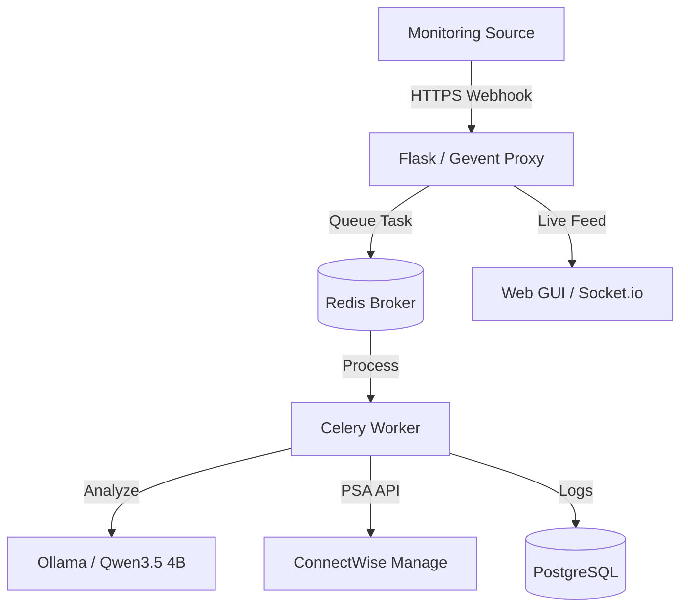
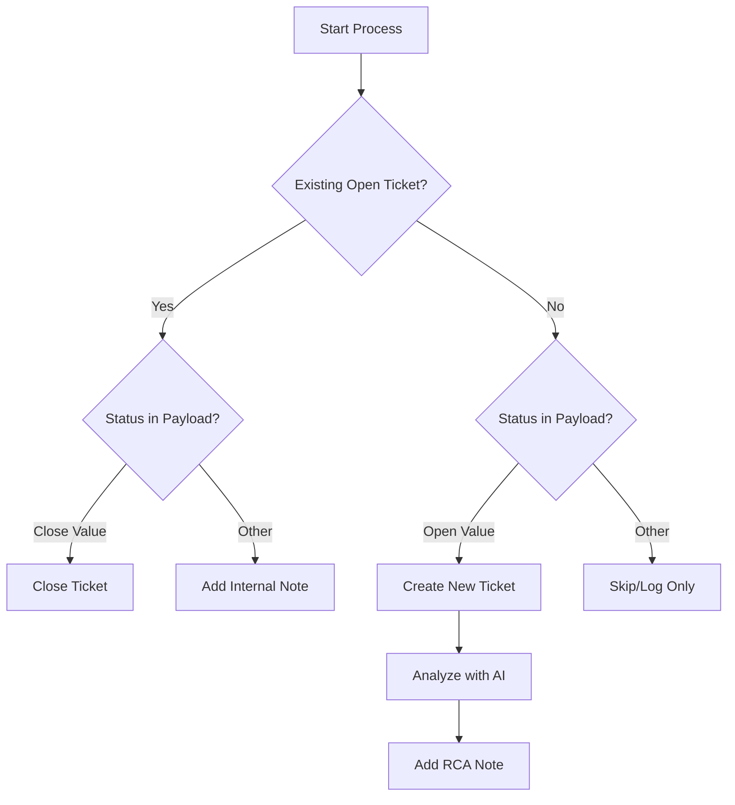
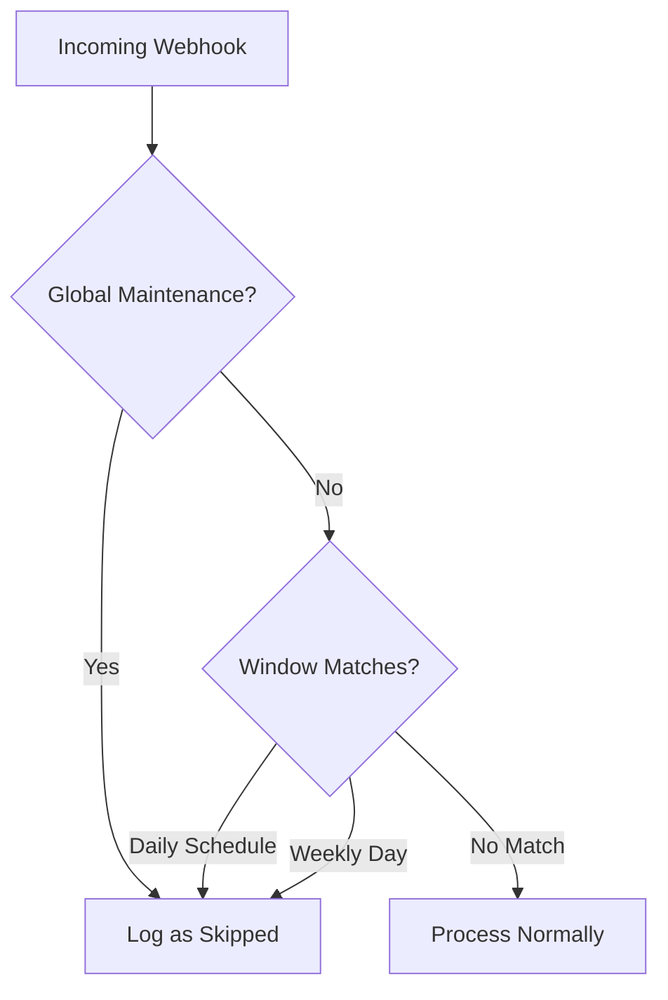
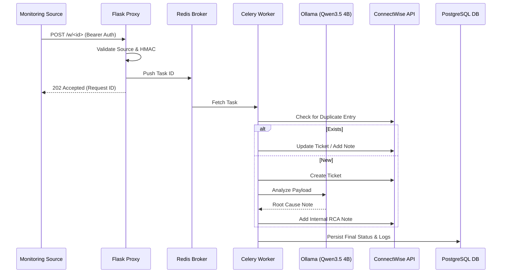

<p align="center">
  
</p>

# HookWise

[](https://github.com/arumes31/hookwise/actions/workflows/ci.yml)
[](https://www.python.org/)
[](https://github.com/astral-sh/ruff)
[](https://opensource.org/licenses/MIT)
[](https://www.docker.com/)

**Enterprise-Grade Webhook Router & ConnectWise Bridge**

HookWise is a highly performant, general-purpose webhook router designed to bridge various monitoring sources (Uptime Kuma, Zabbix, Grafana, Datadog) to **ConnectWise Manage** tickets. Featuring intelligent duplicate detection, asynchronous processing, and local AI-driven analysis.

---

## 📍 Table of Contents
- [Architecture & Flow](#-architecture--flow)
- [Advanced Features](#-advanced-features)
- [API Reference](#-api-reference)
- [AI In-Depth](#-ai-in-depth)
- [Extensive Configuration](#-extensive-configuration)
- [Deep-Dive Usage](#-deep-dive-usage)
- [Configuration Recipes](#-configuration-recipes)
- [Troubleshooting & FAQ](#-troubleshooting--faq)
- [Identity & Access (RBAC + Entra ID)](#-identity--access-rbac--entra-id)
- [Security & Compliance](#-security--compliance)
- [Development & Contributing](#-development--contributing)

---

## 🏗️ Architecture & Flow

### System Overview
HookWise uses a distributed architecture to ensure reliability and low-latency webhook ingestion.


```mermaid
graph TD
    Client[Monitoring Source] -->|HTTPS Webhook| Proxy[Flask / Gevent Proxy]
    Proxy -->|Queue Task| Redis[(Redis Broker)]
    Redis -->|Process| Worker[Celery Worker]
    Worker -->|Analyze| AI[Ollama / Qwen3.5 4B]
    Worker -->|PSA API| CW[ConnectWise Manage]
    Worker -->|Logs| DB[(PostgreSQL)]
    Proxy -->|Live Feed| GUI[Web GUI / Socket.io]
```

### Webhook Processing Pipeline
1.  **Ingestion**: Proxy receives payload, validates source IP and HMAC signature.
2.  **Queuing**: Request is assigned a `request_id` and pushed to Redis.
3.  **Processing**: Celery worker pulls the task.
4.  **Resolution**: JSONPath mappings and Regex routing rules are applied.
5.  **Deduplication**: PSA is queried for existing open tickets with the same summary.
6.  **Action**: Ticket is Created, Updated, or Closed in ConnectWise.
7.  **AI Insights**: For new tickets, Ollama generates an automated RCA note.

#### 🔄 Ticket Management Logic

```mermaid
flowchart TD
    A[Start Process] --> B{Existing Open Ticket?}
    B -- Yes --> C{Status in Payload?}
    C -- "Close Value" --> D[Close Ticket]
    C -- Other --> E[Add Internal Note]
    B -- No --> F{Status in Payload?}
    F -- "Open Value" --> G[Create New Ticket]
    F -- Other --> H[Skip/Log Only]
    G --> I[Analyze with AI]
    I --> J[Add RCA Note]
```

#### 🛡️ Maintenance Suppression Flow

```mermaid
flowchart TD
    A[Incoming Webhook] --> B{Global Maintenance?}
    B -- Yes --> C[Log as Skipped]
    B -- No --> D{Window Matches?}
    D -- "Daily Schedule" --> C
    D -- "Weekly Day" --> C
    D -- No Match --> E[Process Normally]
```

#### ⛓️ The Life of a Webhook (Sequence)

```mermaid
sequenceDiagram
    participant S as Monitoring Source
    participant P as Flask Proxy
    participant R as Redis Broker
    participant W as Celery Worker
    participant A as Ollama (Qwen3.5 4B)
    participant C as ConnectWise API
    participant D as PostgreSQL DB

    S->>P: POST /w/<id> (Bearer Auth)
    P->>P: Validate Source & HMAC
    P->>R: Push Task ID
    P-->>S: 202 Accepted (Request ID)
    
    R->>W: Fetch Task
    W->>C: Check for Duplicate Entry
    alt Exists
        W->>C: Update Ticket / Add Note
    else New
        W->>C: Create Ticket
        W->>A: Analyze Payload
        A-->>W: Root Cause Note
        W->>C: Add Internal RCA Note
    end
    W->>D: Persist Final Status & Logs
```

---

## 🚀 Advanced Features

### 🛠️ Intelligent Routing
- **Regex Rule Engine:** Route `CRITICAL` alerts to the "Emergency" board and `WARN` alerts to "Tiling" automatically.
- **Smart Maintenance:** Define recurring maintenance windows (Daily, Weekly, Once) with support for overnight schedules (e.g., 22:00 to 04:00) using UTC-normalized logic.
- **Company Mapping:** Supports `#CW<ID>` in titles or dynamic lookups from payload fields.
- **Webhook Timeout Alerts (Heartbeat):** Automatically trigger a ticket if an endpoint hasn't received data within a configured threshold (e.g., "No data for 24h"). Alerts repeat at the same hourly interval if the endpoint remains stale, adding a note to the existing ticket or creating a new one if it was closed. The alert state resets as soon as the next webhook arrives.

### 🧠 AI-Powered Insights
HookWise can generate automated troubleshoot guides using local LLMs. It analyzes the raw payload and adds an **internal note** to the ticket with:
- Potential root causes.
- Suggested troubleshooting steps.
- Technical summary of the alert.

**Managing the Model:**
By default, HookWise uses `qwen3.5:4b`. Pull or update it manually with:
```bash
docker exec -it hookwise-llm ollama pull qwen3.5:4b
```

### 📋 Observability
- **Live Activity Hub:** Real-time Socket.io feed of all incoming webhooks.
- **Secure Management:** Integrated endpoint deletion with confirmation prompts and CSRF protection.
- **Audit Trail:** Every configuration change is logged with the user and timestamp.
- **Prometheus Metrics:** Native Export for scrapers like Grafana.

---

## 📋 API Reference

All GUI/Admin endpoints require Session Auth or Basic Auth (if configured). Webhook endpoints require Bearer tokens.

### Webhook Ingestion
- `POST /w/<endpoint_id>`
  - **Auth**: `Authorization: Bearer <token>`
  - **Returns**: `202 Accepted` with `request_id`.

### Internal API (Admin)
- `GET /api/stats`: Returns daily performance data.
- `POST /history/replay/<log_id>`: Re-processes a historic webhook.
- `GET /api/cw/boards`: Cached proxy to ConnectWise boards.
- `GET /health/services`: Real-time health check for Redis, DB, and Celery.
- `POST /admin/maintenance`: Toggle global maintenance mode.

---

## 🔒 HMAC Security & Verification

HMAC (Hash-based Message Authentication Code) provides a way to verify both the **integrity** and the **authenticity** of a webhook. It ensures that the payload hasn't been tampered with and truly originated from your monitoring tool.

### How it Works
1.  **Shared Secret**: You and HookWise share a secret key (configured per endpoint).
2.  **Signing**: Sign `<unix_timestamp>.<unique_nonce>.<raw_request_body>` with HMAC-SHA256.
3.  **Transmission**: Send the signature, timestamp, and nonce headers.
4.  **Verification**: HookWise verifies the signature, rejects timestamps outside five minutes, and accepts each nonce once.

### Implementation Guide (How-to)
If your monitoring tool supports custom headers and signing scripts, use the following logic:

**1. Calculate the Signature** (Python Example):
```python
import hmac
import hashlib
import secrets
import time

secret = "your_hmac_secret_from_gui"
payload = b'{"status": "0", "msg": "Critical Alert"}'
timestamp = str(int(time.time()))
nonce = secrets.token_urlsafe(24)
signed_payload = timestamp.encode() + b"." + nonce.encode() + b"." + payload

signature = hmac.new(
    secret.encode(),
    signed_payload,
    hashlib.sha256
).hexdigest()
```

**2. Send the Request**:
- **Header**: `X-HookWise-Signature: <calculated_signature>`
- **Header**: `X-HookWise-Timestamp: <unix_timestamp>`
- **Header**: `X-HookWise-Nonce: <unique_random_value>`
- **Content-Type**: `application/json`

> [!IMPORTANT]
> Always sign the **raw, unformatted** body. If your tool beautifies the JSON (adds spaces/newlines) after signing, the verification will fail.

---

## 🧠 AI In-Depth

HookWise leverages local LLMs via **Ollama** to provide instant RCA (Root Cause Analysis). This means no data ever leaves your network.

### Model Customization
By default, HookWise uses `qwen3.5:4b`. You can swap this for `phi4-mini`, `llama3.2`, or another model supported by Ollama:

1. **Pull the model**:
   ```bash
   docker exec -it hookwise-llm ollama pull phi4-mini
   ```
2. **Update Configuration**: Set the `AI_MODEL` environment variable to `phi4-mini`.
3. **Restart Worker**: The Celery worker will now use the new model for all analysis.

`AI_MODEL` is read by every LLM request. Set it on both proxy and worker deployments when they do not share the Compose environment block.

Qwen3.5 uses reasoning mode by default. HookWise sets `LLM_THINK=false` so the configured output-token budget is used for the ticket note rather than an internal reasoning trace. For unusually complex alerts, enable thinking and increase `LLM_MAX_TOKENS` to at least `1536`; expect higher CPU latency. `LLM_CONTEXT_LENGTH` defaults to `4096`, which is sufficient for alert payloads while limiting CPU memory usage.

### Endpoint templates

The new-endpoint page includes presets for Uptime Kuma, Zabbix, Grafana, Datadog, and CIPP. A preset only pre-fills routing defaults; review authentication and ConnectWise fields before saving.

### The RCA System Prompt
The analysis is guided by a global system prompt that tells the AI to be concise and focused on remediation. You can customize the **RCA Instructions** per endpoint in the Web GUI, allowing different alerts to receive different styles of analysis (e.g., "Developer-focused" vs "Support-focused").

### 🎚️ Tuning Output Length (`LLM_MAX_TOKENS`)

The `LLM_MAX_TOKENS` environment variable controls how many tokens Ollama is allowed to generate per RCA response. If your notes appear **cut off mid-sentence**, this value is too low.

| Value | Expected Output | RAM Impact | Best For |
|-------|----------------|-----------|---------|
| `100` | 1–2 sentences (often truncated) | ~2–3 GB | Testing only — not recommended |
| `256` | Short paragraph, may truncate complex alerts | ~2–3 GB | Low-RAM environments (≤ 4 GB) |
| `512` *(default)* | Full RCA with 3–5 bullet points | ~3–4 GB | Most deployments |
| `1024` | Detailed multi-section analysis | ~4–6 GB | High-volume or complex MSP environments |
| `2048` | Very long, comprehensive notes | ~6–8 GB | Dedicated LLM host with 8+ GB RAM |

> [!TIP]
> Set `LLM_MAX_TOKENS=512` in your `docker-compose.yml` or `.env`. Larger values increase **response time** linearly — expect ~5–10s per 512 tokens on a 4-core host.

> [!NOTE]
> Token ≠ word. Roughly 1 token ≈ 0.75 words. `512` tokens ≈ ~380 words — enough for a complete, structured RCA note.

---

## ⚙️ Extensive Configuration

### PSA Integration
| Variable | Usage |
|----------|-------|
| `CW_TICKET_PREFIX` | Prefix for all summaries (Default: `Alert:`). |
| `CW_SERVICE_BOARD` | Primary board if not overridden. |
| `CW_STATUS_NEW` | Initial status for new tickets. |
| `CW_STATUS_CLOSED` | Status used when an `UP` alert is received. |
| `VIABILITY_TTL` | Seconds a ticket is cached as "open" before re-checking ConnectWise (Default: `300`). |

### System & Security
| Variable | Usage |
|----------|-------|
| `ENCRYPTION_KEY` | 32-byte Fernet key. **DO NOT LOSE.** |
| `RBAC_ENFORCE` | Role enforcement: `on` (default), `log` (check + log only), `off`. See [Identity & Access](#-identity--access-rbac--entra-id). |
| `ENTRA_*` | Microsoft Entra ID sign-in — see [Identity & Access](#-identity--access-rbac--entra-id). |
| `GUI_USERNAME` / `GUI_PASSWORD` | Basic-auth credentials for headless clients. The username must belong to an **active HookWise account**; its roles decide what the client may do. |
| `GUI_TRUSTED_IPS`| CIDR list (e.g., `10.0.0.0/24, 192.168.1.5`). |
| `LOG_RETENTION_DAYS`| Auto-cleanup limit for `webhook_log` table. |
| `FORCE_HTTPS` | Redirects all traffic to TLS. Requires `HTTPS_ORIGIN`. |
| `HTTPS_ORIGIN` | Trusted public HTTPS origin used for redirects (for example, `https://hookwise.example.com`). |
| `LLM_MAX_TOKENS` | Max tokens for LLM RCA responses (Default: `512`). Increase if output is truncated. |
| `LLM_CONTEXT_LENGTH` | Ollama context allocation per request (Default: `4096`). Increase only for unusually large payloads. |
| `LLM_THINK` | Enable Qwen3.5 reasoning before its response (Default: `false`). Increase the token limit when enabled. |
| `LLM_TIMEOUT` | Seconds to wait for LLM inference (Default: `900`, or 15 minutes). Background tasks and diagnostics include additional shutdown grace. |

---

## 📖 Deep-Dive Usage

### JSONPath Mapping Examples
| Destination | Path Example | Result |
|-------------|--------------|--------|
| **Summary** | `$.monitor.name` | Extracts Uptime Kuma monitor name. |
| **Description**| `$.msg` | Extracts the alert body. |
| **Company** | `$.tags.client_id` | Maps dynamic client IDs. |

#### 🔗 Multi-Variable Mapping
HookWise supports combining multiple JSONPath variables in a single field. Simply space-separate the paths. Empty or null variables in the payload will be automatically ignored. Any segment not starting with `$` is treated as **literal text**.

> [!NOTE]
> The field will only be overridden if **at least one** JSONPath resolves to a non-empty value. Literal-only results are ignored to prevent accidental data loss.

- **Example Mapping**: `"summary": "$.TaskInfo.Tenant $.TaskInfo.Name"`
- **Payload 1**: `{"TaskInfo": {"Tenant": "Acme", "Name": "SRV01"}}` -> **Result**: `Acme SRV01`
- **Payload 2**: `{"TaskInfo": {"Name": "SRV01"}}` -> **Result**: `SRV01`
- **Payload 3**: `"summary": "Prefix $.SomePath"` where `$.SomePath` is missing -> Result: **No Override** (Default monitor name is used).
- **Payload 4**: `"summary": "Prefix $.SomePath"` where `$.SomePath` exists -> Result: `Prefix Value`

### Placeholder Templates
Use these in your "Ticket Description Template":
- `{{ monitor_name }}`: The alert source name.
- `{{ msg }}`: The alert message.
- `{{ request_id }}`: Internal tracking ID.
- `{{ cipp_results }}`: Readable English rendering of every item in a CIPP `Results` array.
- `{$..field}`: Any valid JSONPath (e.g., `{$..heartbeat.status}`).

To suppress certificate-expiry tickets for specific enterprise applications globally, open **Settings > General
Configuration** and enter one exact name or glob pattern per line under **CIPP Certificate Expiry Exclusions**.
Matching is case-insensitive and supports `*` and `?` wildcards. Excluded items are removed before formatting. A
webhook containing only excluded applications is recorded as skipped and does not create or update a ConnectWise
ticket.

Example universal CIPP template:
```text
CIPP Alert

Tenant: {$.Tenant}
Alert: {$.TaskInfo.Name}
Source: {$.TaskInfo.Command}
Hookwise Request ID: {{ request_id }}

{{ cipp_results }}
```

### Web GUI Shortcuts
- ` / ` : Focus Search bar.
- `Esc` : Close any open modal.
- `Drag & Drop` : Reorder endpoint priority on the dashboard.

---

## 🚀 Configuration Recipes

### 1. Uptime Kuma (Standard)
Perfect for basic UP/DOWN monitoring.

- **Trigger Field**: `$.heartbeat.status`
- **Open Value**: `0`
- **Close Value**: `1`
- **JSON Mapping**:
  ```json
  {
    "summary": "$.monitor.name",
    "description": "$.heartbeat.msg",
    "customer_id": "$.monitor.tags.CW_ID"
  }
  ```

### 2. Generic Status Webhook
For tools that send text-based statuses like "CRITICAL" or "OK".

- **Trigger Field**: `$.status_text`
- **Open Value**: `CRITICAL, WARNING`
- **Close Value**: `OK, RESOLVED`
- **Ticket Prefix**: `Infrastructure Alert:`

### 3. Advanced Regex Routing
Route alerts to different boards based on the hostname.

- **Routing Rules**:
  ```json
  [
    {
      "path": "$.monitor.hostname",
      "regex": ".*-DB-.*",
      "overrides": {
        "board": "Database Team",
        "priority": "High"
      }
    },
    {
      "path": "$.monitor.hostname",
      "regex": ".*-FE-.*",
      "overrides": {
        "board": "Frontend Team"
      }
    }
  ]
  ```

### 4. Zabbix (Enterprise)
Great for detailed system health and event severity.

- **Trigger Field**: `$.event.status`
- **Open Value**: `PROBLEM`
- **Close Value**: `OK, RESOLVED`
- **JSON Mapping**:
  ```json
  {
    "summary": "$.event.name",
    "severity": "$.event.severity",
    "description": "Trigger: {$.trigger.description}\nHost: {$.host.name}"
  }
  ```

### 5. Grafana Alertmanager
Handle firing and resolved alerts from Grafana dashboards.

- **Trigger Field**: `$.status`
- **Open Value**: `firing`
- **Close Value**: `resolved`
- **JSON Mapping**:
  ```json
  {
    "summary": "$.alerts[0].annotations.summary",
    "description": "$.alerts[0].annotations.description"
  }
  ```

---

## 🏢 Dynamic Company Identification

HookWise provides several ways to automatically map alerts to the correct ConnectWise Client without creating separate endpoints for every customer.

### 1. The "#CW" Magic String (Simplest)
If your monitor name contains `#CW` followed by a ConnectWise Company Identifier, HookWise will automatically route the ticket to that company.
- **Example Monitor Name**: `Firewall Down #CW-AcmeCorp`
- **Result**: Ticket created for company `AcmeCorp`.

### 2. JSONPath Mapping
Map a specific field in the webhook payload directly to the ConnectWise company ID.
- **Mapping**: `"customer_id": "$.tags.client_id"`

### 3. Regex Overrides
Use Routing Rules to map specific hostnames or message patterns to different companies.
- **Rule**: `{"path": "$.host", "regex": "PRD-CL1-.*", "overrides": {"customer_id": "CLIENT_A"}}`

### 4. TenantMap (Global Routing)
HookWise provides a centralized mapping table called **TenantMap** (found in the navbar). This allows you to map common client identifiers (like domains or company IDs) once and apply them globally across all your endpoints.

- **Centralized Link**: Map `example.com` -> `EXAMPLE` just once.
- **Auto-Scanning**: HookWise intelligently scans incoming payloads for fields like `Tenant`, `tenantId`, and `$.TaskInfo.Tenant`.
- **Per-Endpoint Toggle**: You can enable or disable TenantMap lookups for each specific endpoint in its configuration form.

> [!TIP]
> Use TenantMap for high-volume client identification to avoid repeating the same mapping rules in dozens of different endpoint configurations.

---

## 🛠️ Troubleshooting & FAQ

**Q: Why are tickets not closing automatically?**
- Verify that your `Close Value` in the endpoint config matches the payload exactly (e.g., `1` vs `UP`).
- Check if the ticket summary has been manually changed in ConnectWise.

**Q: "Redis connection refused" in logs?**
- Ensure the `redis` container is running and the `REDIS_PASSWORD` matches in both the `redis` and `hookwise` services.

**Q: AI RCA is too slow?**
- LLM inference is CPU-heavy. Ensure the `hookwise-llm` container has at least 4 cores and 8GB RAM assigned.
- Consider switching to a smaller model (e.g., `llama3.2:3b` instead of larger variants).

**Q: Getting "400 Bad Request" when creating tickets?**
- This usually means ConnectWise rejected the payload due to a missing or invalid field.
- **Check the History**: Go to the "History" tab in the GUI. I've updated the logging to show the *exact* error message from ConnectWise in the "Error Message" column.
- Common causes: Invalid `board`, `priority`, or `status` name that doesn't exist on the target board.

**Q: Metrics at `/metrics` are missing some counters?**
- If you don't see `hookwise_webhooks_total` or other custom metrics, ensure your **Celery worker** and **Web proxy** can both reach the same Redis instance.
- HookWise uses Redis to aggregate metrics across process boundaries; if Redis is down or partitioned, counters will restart at zero or appear empty.

**Q: HMAC verification fails on every request?**
- Ensure your monitoring tool is sending the payload as raw JSON.
- If your tool adds extra whitespace or re-orders JSON keys after signing, the signature won't match.
- Ensure all three HMAC headers are present, the timestamp is within five minutes, and every request uses a fresh nonce.

---

## 🔐 Identity & Access (RBAC + Entra ID)

HookWise ships a role-based access model and optional Microsoft Entra ID
single sign-on. Everything is managed on the **Identity** page
(`/settings/identity`, requires `user:read`).

### Roles & permissions

Permissions follow the `resource:action` scheme (17 keys, defined in
`hookwise/rbac/catalog.py` — the code is the single source of truth). Three
built-in roles are seeded and kept up to date automatically:

| Role | Grants |
|------|--------|
| `admin` | All 17 permissions, including user management and system settings. |
| `operator` | Day-to-day operations **including delivery credentials** (`secret:reveal`, `secret:rotate`), endpoint write/archive/test, replay, tenant mapping, audit — no user management, no settings writes, no history deletion. |
| `viewer` | Read-only: dashboard, endpoints, history, tenant map, settings view. |

Custom roles can be created in the permission matrix. Each user holds exactly
one role (assigned via the Identity page). Accounts still carrying only the
legacy `role` column behave as before: `admin` → admin, `user`/`operator` →
operator, `viewer` → viewer. Revoking a role takes effect on the next request
(permissions epoch), not the next login. The UI hides actions the session
lacks; secrets stay visible but locked, so their existence remains auditable.

### Enforcement modes (`RBAC_ENFORCE`)

| Mode | Behaviour |
|------|-----------|
| `on` *(default)* | Denied requests get a 403 (JSON for APIs, a 403 page for views). |
| `log` | Checks and logs `RBAC(log)` warnings, but never blocks — rollout/diagnosis stage. |
| `off` | No permission checks (pre-RBAC behaviour). |

The routes that always enforced their own boundary (secret reveal/rotate,
replay, history operations) keep blocking in **every** mode.

No database migration is required: an idempotent schema bridge creates the
RBAC tables and user columns at startup (Postgres advisory lock, safe with
multiple containers booting in parallel).

### Microsoft Entra ID sign-in

Configured entirely through the environment; without it the Entra routes stay
inert and local login is unchanged.

| Variable | Usage |
|----------|-------|
| `ENTRA_ENABLED` | `true` activates the sign-in button and callback routes. |
| `ENTRA_TENANT_ID` / `ENTRA_CLIENT_ID` | App registration (single tenant; the tenant is verified on every login). |
| `ENTRA_REDIRECT_URL` | Must match the registration, e.g. `https://host/auth/entra/callback`. |
| `ENTRA_CLIENT_SECRET_FILE` | Path to a mounted secret file — the secret never lives in env or DB. |
| `ENTRA_SCOPES` | Default `openid profile email`. |
| `ENTRA_AUTO_PROVISION` / `ENTRA_AUTO_PROVISION_ROLE` | Start values only; the runtime switch on the Identity page (stored in Redis) takes precedence. |

An optional **group filter** (Identity page) restricts sign-in to members of one
Entra group. It is enforced fail-closed: with a filter set, a token that carries
no matching `groups` claim is refused, so the app registration must be
configured to emit group claims (optional claims → groups).

Two provisioning modes, switchable at runtime on the Identity page:
**pre-provisioned only** (an account must exist here; it binds to the Entra
object on first sign-in) or **automatic** (any user the tenant assigns gets an
account with the chosen start role — roles holding privileged permissions such
as `secret:*` or `user:manage` are rejected as start roles, so auto-provisioning
can never create an administrator). Only the stable `tid`/`oid` pair is stored,
never tokens. Entra accounts have no local password or app MFA — both are
Microsoft's job — and their UPN is frozen while bound (clear the binding on the
Identity page to edit it).

### User management

Each row on the Identity page expands into a management panel: rename,
set a new password (local accounts, min. 8 characters), reset MFA (shown only
when enrolled), clear the Entra binding, enable/disable and delete. Two
invariants are enforced server-side: the last active holder of `user:manage`
cannot be deactivated or deleted, and you cannot delete your own account.

**Note for headless/API clients:** HTTP Basic Auth authenticates against
`GUI_USERNAME`/`GUI_PASSWORD` but now also requires an **active HookWise
account with that username** — the former synthetic admin session is gone.

---

## 🛡️ Security & Compliance
- **Data Privacy**: Webhook payloads are masked (`********`) in audit logs if they contain sensitive keys like `token` or `password`.
- **Encryption**: Bearer tokens and HMAC secrets are encrypted using AES-128 via the Fernet protocol.
- **Secure Identifiers**: Uses high-entropy, 64-character URL-safe tokens for endpoint IDs to prevent brute-force discovery.
- **Air-Gap Support**: All assets (Bootstrap, Socket.io, Prism.js) are bundled locally. No external CDNs are used.

---

## 📄 Development & Contributing

### Linting & Formatting
We use `ruff` for code quality:
```bash
ruff check .
ruff format .
```

### Database Migrations
When changing `models.py`:
```bash
flask db migrate -m "Description"
flask db upgrade
```

---

## 📄 License
MIT License - Copyright (c) 2026 HookWise Team.


