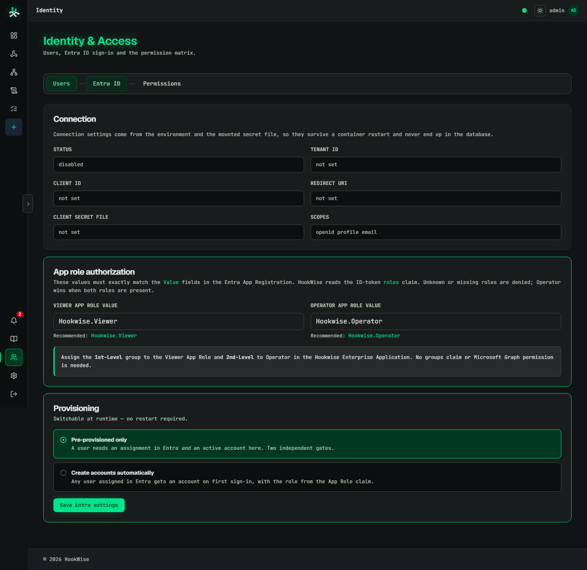

# Microsoft Entra ID SSO mit App Roles

> Die kombinierte, bebilderte und druckoptimierte Version dieser Anleitung ist
> als [HTML-Installationsguide](ENTRA_SSO_SETUP.html) verfügbar.

Diese Anleitung verbindet Hookwise als single-tenant OpenID-Connect-Webanwendung
mit Microsoft Entra ID. Entra-Gruppen werden App Roles zugewiesen; Hookwise liest
beim Login den `roles`-Claim des ID-Tokens.

> **Wo wird konfiguriert?** Die Microsoft-Seite dieser Einrichtung erfolgt im
> [Microsoft Entra Admin Center](https://entra.microsoft.com), nicht im
> klassischen Microsoft-365-Admin-Center. Microsoft 365 verwendet dasselbe
> Verzeichnis, die App Registration und Enterprise Application werden jedoch in
> Entra verwaltet.

## Ergebnis

| Entra-Gruppe | Entra App Role | Hookwise-Rolle |
|---|---|---|
| `1st-Level` | `Hookwise.Viewer` | `viewer` |
| `2nd-Level` | `Hookwise.Operator` | `operator` |

Ist ein Benutzer beiden App Roles zugewiesen, verwendet Hookwise immer
`operator`. Fehlt eine bekannte App Role, wird die Anmeldung abgelehnt.

## Voraussetzungen

- Eine öffentliche HTTPS-URL für Hookwise, zum Beispiel
  `https://hookwise.example.com`.
- Rechte zum Erstellen einer App Registration und zum Verwalten der zugehörigen
  Enterprise Application.
- Microsoft Entra ID P1 oder P2 für gruppenbasierte App-Zuweisungen.
- Entra Security Groups mit direkten Benutzermitgliedschaften. Verschachtelte
  Gruppen werden bei der Zuweisung zu Enterprise Applications nicht unterstützt.
- Ein lokales Hookwise-Break-Glass-Administratorkonto, bevor SSO aktiviert wird.

Vor dem Start diese Werte festlegen. Die Namen sind Beispiele; die **App Role
Values** müssen in Entra und Hookwise exakt (inklusive Groß-/Kleinschreibung)
übereinstimmen.

| Zweck | Beispiel |
|---|---|
| Öffentliche Hookwise-URL | `https://hookwise.example.com` |
| Redirect URI | `https://hookwise.example.com/auth/entra/callback` |
| Viewer-Gruppe | `1st-Level` |
| Operator-Gruppe | `2nd-Level` |
| Viewer App Role Value | `Hookwise.Viewer` |
| Operator App Role Value | `Hookwise.Operator` |

Microsoft-Dokumentation:

- [App registrieren](https://learn.microsoft.com/en-us/entra/identity-platform/quickstart-register-app)
- [App Roles definieren](https://learn.microsoft.com/en-us/entra/identity-platform/howto-add-app-roles-in-apps)
- [Benutzer und Gruppen zuweisen](https://learn.microsoft.com/en-us/entra/identity/enterprise-apps/assign-user-or-group-access-portal)

## 1. App Registration anlegen

1. Im [Microsoft Entra Admin Center](https://entra.microsoft.com) zu
   **Entra ID → App registrations → New registration** wechseln.
2. Als Namen `Hookwise` eintragen.
3. **Accounts in this organizational directory only** auswählen.
4. Unter **Redirect URI (optional)** den Typ **Web** auswählen und folgende URI
   eintragen:

   ```text
   https://hookwise.example.com/auth/entra/callback
   ```

5. Registrierung abschließen.
6. Auf der Overview-Seite folgende Werte notieren:
   - **Application (client) ID**
   - **Directory (tenant) ID**

Falls die URI bei der Registrierung ausgelassen wurde: **Authentication → Add a
platform → Web** öffnen, die URI eintragen und speichern. Die Redirect URI muss
Zeichen für Zeichen mit `ENTRA_REDIRECT_URL` übereinstimmen: Schema, Host, Port,
Pfad und ein eventueller abschließender Slash zählen. Für Produktion nur HTTPS
verwenden; `http://localhost` ist ausschließlich für lokale Tests gedacht.

## 2. Client Secret erzeugen

1. In der App Registration zu **Certificates & secrets → Client secrets**
   wechseln.
2. Ein neues Secret mit einer zur eigenen Rotationsrichtlinie passenden Laufzeit
   anlegen.
3. Den Secret-Wert sofort kopieren. Später ist er nicht erneut sichtbar.
4. Den Wert auf dem Hookwise-Host in eine nur für den Container lesbare Datei
   schreiben, zum Beispiel `./secrets/entra_client_secret`. Den Secret-Mount in
   `docker-compose.override.yml` aktivieren; im Container liegt die Datei dann
   unter:

   ```text
   /run/secrets/entra_client_secret
   ```

Der Secret-Wert gehört nicht in Git, nicht in die Datenbank und nicht direkt in
eine Umgebungsvariable. Hookwise liest ihn ausschließlich aus der Datei, deren
Pfad `ENTRA_CLIENT_SECRET_FILE` angibt.

Microsoft begrenzt Client Secrets derzeit auf höchstens 24 Monate und empfiehlt
eine Laufzeit unter 12 Monaten. Ablaufdatum und verantwortliche Person deshalb
im Betriebsprozess hinterlegen. **Value** kopieren, nicht die **Secret ID**.

## 3. App Roles erstellen

In der App Registration **App roles → Create app role** öffnen und zwei Rollen
anlegen.


*Microsoft-Ansicht: App Registration → App roles.*

### Viewer

| Feld | Wert |
|---|---|
| Display name | `Hookwise Viewer` |
| Allowed member types | `Users/Groups` |
| Value | `Hookwise.Viewer` |
| Description | `Read-only access to Hookwise` |
| Enabled | Ja |

### Operator

| Feld | Wert |
|---|---|
| Display name | `Hookwise Operator` |
| Allowed member types | `Users/Groups` |
| Value | `Hookwise.Operator` |
| Description | `Operational access to Hookwise` |
| Enabled | Ja |

Entscheidend sind die beiden **Value**-Felder. Genau diese Strings erscheinen im
`roles`-Claim und werden in Hookwise konfiguriert. Eine zusätzliche
`groups`-Claim-Konfiguration ist nicht erforderlich.


*Microsoft-Ansicht: Rolle mit Allowed member types `Users/Groups` anlegen.*

## 4. Gruppen den App Roles zuweisen

1. Zu **Entra ID → Enterprise applications → Hookwise** wechseln.
2. Unter **Properties** die Option **Assignment required?** auf **Yes** setzen.
3. **Users and groups → Add user/group** öffnen.
4. Gruppe `1st-Level` auswählen und Rolle **Hookwise Viewer** zuweisen.
5. Gruppe `2nd-Level` auswählen und Rolle **Hookwise Operator** zuweisen.


*Microsoft-Ansicht: Enterprise applications → Users and groups → Add assignment.*

Die Gruppenmitgliedschaft kann in Entra dynamisch verwaltet werden. Für die
Enterprise-App-Zuweisung zählt die direkte Mitgliedschaft des Benutzers in der
zugewiesenen Gruppe.

Bei **Assignment required? = Yes** benötigt die Anwendung Admin Consent; Benutzer
können nicht selbst zustimmen. Falls die erste Anmeldung eine Consent-Meldung
zeigt, in **Enterprise applications → Hookwise → Permissions** als Administrator
**Grant admin consent** ausführen. Für direkte Benutzerzuweisungen reicht eine
passende Verzeichnisrolle; gruppenbasierte Zuweisungen erfordern Entra ID P1
oder P2. Verschachtelte Gruppen werden nicht ausgewertet.

## 5. Hookwise konfigurieren

Folgende Werte in der Hookwise-Umgebung setzen:

```dotenv
ENTRA_ENABLED=true
ENTRA_TENANT_ID=00000000-0000-0000-0000-000000000000
ENTRA_CLIENT_ID=00000000-0000-0000-0000-000000000000
ENTRA_REDIRECT_URL=https://hookwise.example.com/auth/entra/callback
ENTRA_CLIENT_SECRET_FILE=/run/secrets/entra_client_secret
ENTRA_SCOPES=openid profile email
ENTRA_VIEWER_APP_ROLE=Hookwise.Viewer
ENTRA_OPERATOR_APP_ROLE=Hookwise.Operator
ENTRA_AUTO_PROVISION=false
```

Secret-Datei und Compose-Mount, Beispiel:

```yaml
services:
  hookwise-proxy:
    volumes:
      - type: bind
        source: ./secrets/entra_client_secret
        target: /run/secrets/entra_client_secret
        read_only: true
        bind:
          create_host_path: false
```

Die bereits enthaltenen Hookwise-Compose-Dateien bilden diesen Mount ab. Die
Datei muss auf dem Docker-Host existieren und darf nur für den vorgesehenen
Betriebsaccount lesbar sein.

Bei der Standard-Compose-Installation führt der Service `hookwise-migrate` die
Alembic-Migration vor dem Anwendungsstart aus:

```shell
docker compose up -d
```

Bei einer Installation ohne Compose zuerst `flask db upgrade` ausführen und
danach die Anwendungsprozesse neu starten. Für das GHCR-Compose-File den lokalen
Override mitladen, damit der Secret-Mount greift:

```shell
docker compose -f docker-compose.ghcr.yml -f docker-compose.override.yml up -d
```

Danach den Zustand prüfen:

```shell
docker compose ps
docker compose logs hookwise-migrate
docker compose exec hookwise-proxy flask db current
```

Erwartung: Der App-Service ist `healthy`, die Migration endete erfolgreich und
`flask db current` zeigt `d9f1a7c4e2b6 (head)`.

Die Runtime-Schema-Bridge ergänzt die neuen Benutzerfelder ebenfalls
idempotent beim Start. Die Alembic-Migration bleibt die maßgebliche
Deployment-Historie.

## 6. Einstellungen in Hookwise prüfen

1. Mit dem lokalen Break-Glass-Administrator anmelden.
2. **Identity & Access → Entra ID** öffnen.
3. Connection-Status, Tenant ID, Client ID und Redirect URI prüfen.
4. Unter **App role authorization** prüfen:
   - Viewer App Role Value: `Hookwise.Viewer`
   - Operator App Role Value: `Hookwise.Operator`
5. Provisionierungsmodus auswählen:
   - **Pre-provisioned only**: Der Benutzer muss vorher in Hookwise angelegt sein.
   - **Create accounts automatically**: Ein Benutzer mit erkannter App Role wird
     beim ersten Login angelegt und erhält direkt die gemappte Rolle.
6. **Save Entra settings** auswählen.



*Hookwise-Testumgebung: Identity & Access → Entra ID. Der abgebildete Status
`disabled` ist der sichere, noch nicht konfigurierte Ausgangszustand. Nach dem
Setzen aller Werte und einem Neustart muss hier `ready` stehen.*

In der Oberfläche gespeicherte App-Role-Werte liegen in Redis und haben Vorrang
vor den Umgebungsvariablen. Bei nicht erreichbarem Redis verwendet Hookwise die
Umgebungswerte.

## 7. Manuellen Override verwenden

1. **Identity & Access → Users** öffnen.
2. Beim Entra-Benutzer **Authorization** auswählen.
3. **Use manual override** aktivieren.
4. `viewer` oder `operator` auswählen und speichern.

Der Override ersetzt die Entra-Rolle vollständig. Er erweitert sie nicht. Beim
Deaktivieren des Schalters greift sofort wieder die zuletzt beim Entra-Login
synchronisierte App Role. Jede Änderung wird auditiert und erhöht den Hookwise
Permissions-Epoch, sodass bestehende Sitzungen beim nächsten Request neu
ausgewertet werden.

## 8. Abnahmetest

Für jeden Fall ein privates Browserfenster verwenden oder Microsoft vollständig
abmelden, damit wirklich ein neues ID-Token ausgestellt wird. Im Hookwise Audit
Log anschließend `entra_login` beziehungsweise bei Ablehnung
`entra_login_denied` kontrollieren.

| Testbenutzer | Erwartung |
|---|---|
| nur `1st-Level` | Login erfolgreich, effektive Rolle `viewer` |
| nur `2nd-Level` | Login erfolgreich, effektive Rolle `operator` |
| beide Gruppen | Login erfolgreich, effektive Rolle `operator` |
| keine zugewiesene App Role | Login abgelehnt |
| Operator mit Viewer-Override | effektive Rolle `viewer` |
| Viewer mit Operator-Override | effektive Rolle `operator` |

Nach einer Änderung der Entra-Gruppen- oder App-Role-Zuweisung muss der Benutzer
eine neue Entra-Anmeldung durchführen, damit ein neues ID-Token ausgestellt und
die Rolle erneut synchronisiert wird. Ein lokaler Override wirkt dagegen bei der
nächsten Hookwise-Anfrage.

## Fehlerdiagnose

### `no recognized Hookwise App Role`

- Benutzer oder direkte Gruppe ist keiner App Role zugewiesen.
- Das Entra-App-Role-Value stimmt nicht exakt mit dem Hookwise-Wert überein.
- Der Benutzer verwendet noch ein altes Token. Abmelden und neu anmelden.

### `foreign tenant`

Die `tid` im ID-Token stimmt nicht mit `ENTRA_TENANT_ID` überein.

### Entra-Schaltfläche fehlt oder leitet zum lokalen Login zurück

- `ENTRA_ENABLED` ist nicht `true`.
- Tenant ID, Client ID oder Redirect URL fehlen.
- Die Secret-Datei ist leer, nicht gemountet oder für den Container nicht lesbar.
- Das Python-Paket `msal` fehlt im Image.

### `AADSTS50011` / Redirect URI mismatch

- Den vollständigen Callback aus der Fehlermeldung mit der **Web** Redirect URI
  in der App Registration vergleichen.
- Reverse-Proxy-Schema, Hostname und Port prüfen. Hookwise und Entra müssen
  denselben extern sichtbaren Wert verwenden.

### Login funktioniert, aber die neue Gruppenrolle noch nicht

- Unter **Enterprise applications → Hookwise → Users and groups** prüfen, ob die
  Gruppe wirklich der richtigen Rolle zugewiesen ist.
- Sicherstellen, dass der Benutzer direktes Mitglied der Gruppe ist.
- Microsoft abmelden und neu anmelden; ein bestehendes ID-Token ändert sich
  nicht nachträglich.

Persistiert werden nur die stabile `tid`/`oid`-Bindung, der aktuelle UPN, die
zuletzt synchronisierte Hookwise-Rolle und der optionale manuelle Override.
Hookwise speichert keine ID-, Access- oder Refresh-Tokens.
